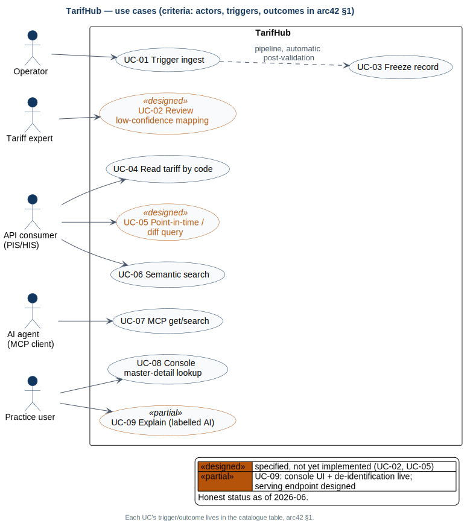

# 01 · introduction goals

TarifHub harmonises Switzerland's fragmented ambulatory tariff data into **one canonical, versioned, deterministic API**. AI assists the harmonisation *above* a freeze line — gap-filling non-billing fields, explaining mappings — and never operates below it: frozen records are immutable, hashed and served verbatim.

## Problemstellung

Switzerland's ambulatory tariff data is fragmented. Roughly 110 active tariff types are published across 20+ sources in XLSX, XML, PDF and FHIR, with **no single authoritative machine interface** — the public BAG lists alone arrive as semiannual EAL XLSX (three DE/FR/IT sheets) and monthly ePL FHIR NDJSON. The consequences compound downstream:

- every PIS/HIS vendor re-implements parsing per source, multiplying the same brittle work;
- tariff values reach billing systems **without verifiable provenance** — there is no way to prove a served value is the one that was reviewed;
- version transitions (semiannual EAL updates on 1.1 / 1.7, monthly SL on the 1st) are reconciled by hand;
- and an uncaught mapping error propagates silently — it becomes a wrong invoice.

## Vision

One trustworthy machine interface to ambulatory tariff data — in its three elements:

- **Zielgruppe:** PIS/HIS vendors as machine consumers (REST/OpenAPI + FHIR R4 read), tariff experts who review uncertain mappings, practice users who look up records in the console, and AI agents that read frozen data over MCP.
- **Bedürfnis:** one versioned, provenance-carrying interface where a *served value is provably the value that was reviewed and frozen* — replacing per-vendor parsing and hand-reconciled version transitions with a single auditable source.
- **Abgrenzung:** the CAS/MVP scope is the **data foundation** (two BAG sources: EAL XLSX, ePL FHIR R5), a **thin read-only serving API + MCP tools**, and the **TarifGuard console demo** (master-detail lookup, review form, labelled explain panel; [ADR-013](../adr/013-demo-scope.md)). Explicitly out of scope at MVP: TARDOC, patient data anywhere, benchmarking, and the review POST loop (design scope only).

> **No AI computes or mutates a billing value at serve time.**

### KI-Nutzen je Kernfunktion

- **UC-01 (harmonise):** fill-only AI gap-filling of non-billing fields pre-freeze through a single seam with structured output ([ADR-005](../adr/005-single-ai-seam.md)).
- **UC-03 (freeze):** freeze seals AI contributions with provenance (`ai_model`, `ai_fields` recorded in metadata) into immutable, hash-verifiable versions — AI work becomes auditable, never silently mutable.
- **UC-04 (serve deterministically):** deliberately zero AI — the value path is provably LLM-free, enforced by an AST boundary test in CI; the determinism guarantee *is* the feature.
- **UC-06 (find):** multilingual-e5 embeddings give cross-lingual DE/FR/IT retrieval over frozen records; ML ranks, never alters, the served values.
- **UC-09 (explain):** a labelled, de-identified AI explanation seam that can never change a served value.

## Functional requirements

| ID | Requirement | Realised by |
|---|---|---|
| FR-1 | Ingest & harmonise BAG sources (EAL XLSX, ePL FHIR R5) into the canonical TariffRecord | UC-01 |
| FR-2 | AI-assisted gap-fill pre-freeze: fill-only, non-billing fields, single seam (ADR-005) | UC-01 |
| FR-3 | Deterministic validation + confidence scoring; < 0.85 routes to human review | UC-02 |
| FR-4 | Freeze: immutable versioned records, SHA-256 record_hash, append-only audit_log | UC-03 |
| FR-5 | Serve frozen records deterministically by system+code (REST, OpenAPI) | UC-04 |
| FR-6 | Point-in-time and diff queries over record versions | UC-05 |
| FR-7 | Multilingual semantic search (pgvector HNSW cosine, multilingual-e5 embeddings) | UC-06 |
| FR-8 | Read-only MCP tools: search_tariffs, get_tariff, explain_crosswalk | UC-07, UC-09 |
| FR-9 | TarifGuard console: master-detail lookup, review form (designed), labelled AI explain panel | UC-02, UC-08, UC-09 |

## Use-case catalogue

### Kernfunktionen

These five form the platform's value chain — harmonise → freeze → serve deterministically → find → explain.

| ID | Use case | Actor | Trigger | Outcome | Realises | Status |
|---|---|---|---|---|---|---|
| UC-01 | Trigger ingest | Operator (CLI/scheduler) | new BAG source version published / operator runs pipeline | validated, scored records frozen + audited | FR-1, FR-2 | live |
| UC-03 | Freeze record | Pipeline (automatic post-validation; expert approval loop designed) | record passes deterministic validation and scoring | immutable version with SHA-256 record_hash + append-only audit entry | FR-4 | live |
| UC-04 | Read tariff by code | API consumer (PIS/HIS) | GET /api/v1/tariffs/{system}/{code} | frozen record, served verbatim | FR-5 | live |
| UC-06 | Semantic search | API consumer | free-text query (DE/FR/IT) against the search endpoint | ranked frozen records via pgvector cosine similarity | FR-7 | live |
| UC-09 | Explain (crosswalk, labelled AI) | Practice user | user opens the labelled AI explain panel on a record | AI-labelled, de-identified explanation; served values never altered | FR-8, FR-9 | live — console UI + de-id live, serving endpoint (this release) |

### Supporting use cases

These parameterise or proxy the Kernfunktionen — the review threshold loop, version-time access, the MCP proxy, and console lookup.

| ID | Use case | Actor | Trigger | Outcome | Realises | Status |
|---|---|---|---|---|---|---|
| UC-02 | Review low-confidence mapping | Tariff expert (console form) | confidence score < 0.85 flags a frozen record into the review queue | expert approves or corrects the flagged mapping; an accepted correction becomes a new frozen version | FR-3, FR-9 | designed (ADR-013) |
| UC-05 | Point-in-time / diff query | API consumer | query with a valid-at date or two record versions | record state as of that date / field-level diff | FR-6 | live (this release) |
| UC-07 | MCP get/search | AI agent (MCP client) | MCP tool call search_tariffs / get_tariff | read-only frozen data, proxied from the serving API | FR-8 | live |
| UC-08 | Console master-detail lookup | Practice user | search in the TarifGuard console | frozen record detail with provenance and hash | FR-9 | live |

The actors and their nine use cases, with system boundary:

## Quality goals

The top quality goals are **determinism** (the same query returns the same tariff value, with provable provenance), **reproducibility** (offline tests, pinned environments, hash-verifiable records) and **auditability** (every value traceable to source, version and append-only audit_log). They are quantified as SMART NFRs in [§10](10-quality-requirements.md); the solution approach that satisfies them is in [§4](04-solution-strategy.md), with the underlying decisions in [§9](09-architecture-decisions.md).

## Stakeholders

| Stakeholder | Concern | Key use cases |
|---|---|---|
| CAS graders / lecturer | Assessable evidence in code and documentation: architecture, AI-assisted method, distribution — nothing requires deployment to grade | all (evidence) |
| Tariff experts | Catch and correct uncertain mappings before freeze; trust that frozen values are never silently changed | UC-02, UC-03 |
| PIS/HIS vendors (API consumers) | Stable, deterministic, versioned REST/OpenAPI access to tariff data | UC-04, UC-05, UC-06 |
| Practice users | Fast, reliable tariff lookup in the console; AI assistance clearly labelled and never authoritative for values | UC-08, UC-09 |
| AI agents (MCP clients) | Read-only, well-typed tool access to frozen tariff data | UC-07 |
| Solo maintainer (Erhan Ünlü) | Few well-understood components, AI-assisted velocity, CAS hand-in on 6 July 2026 | UC-01 |
