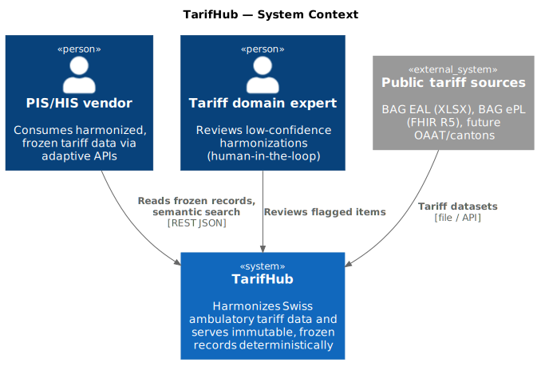
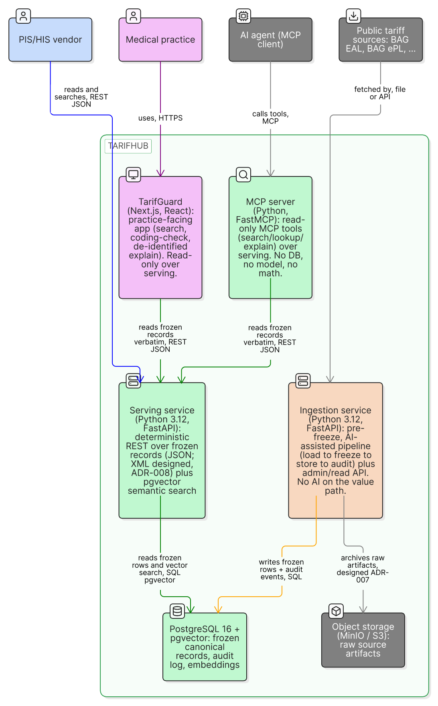
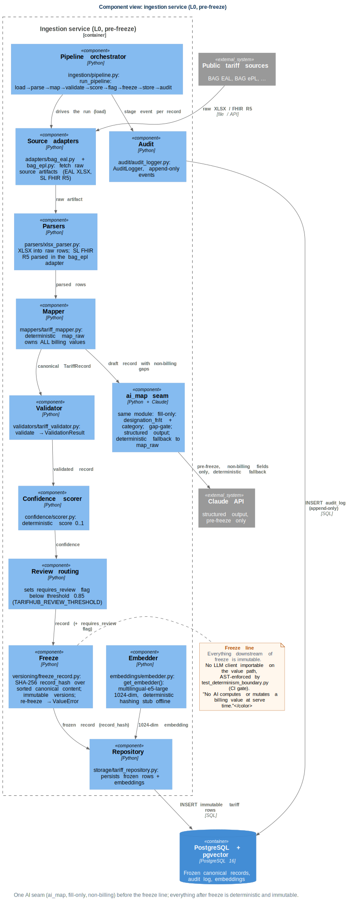
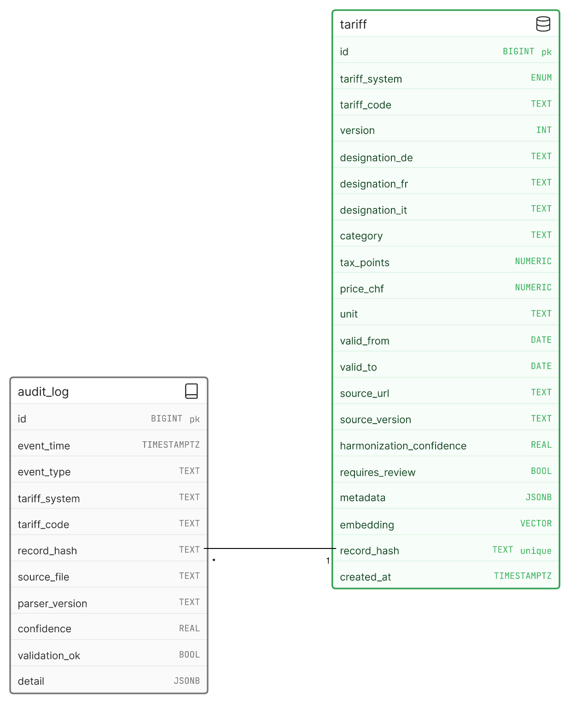
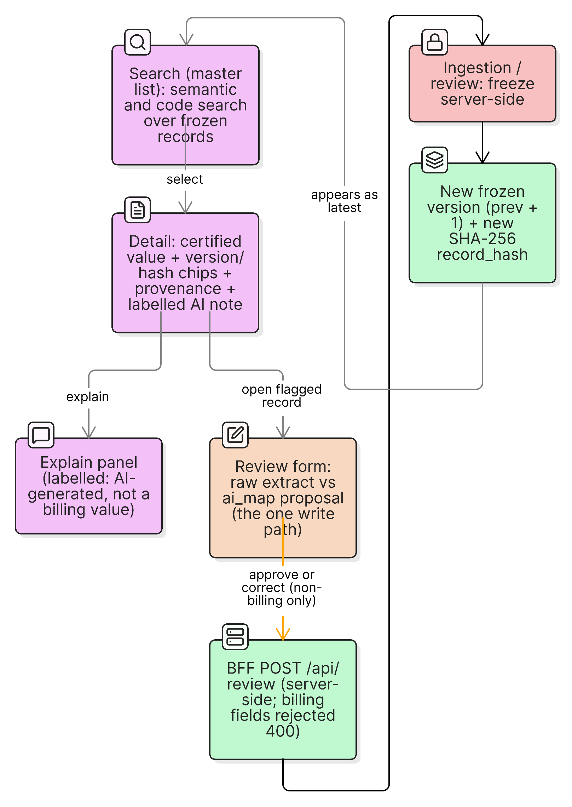
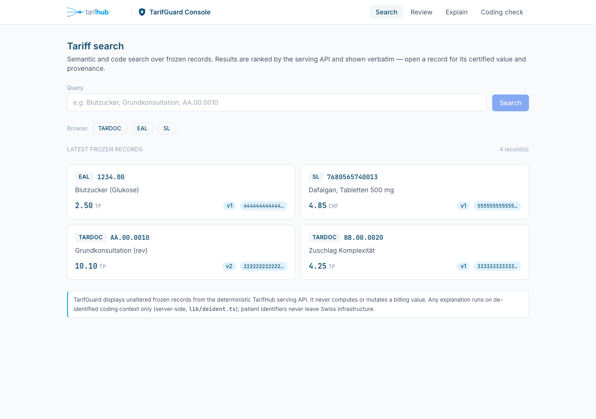
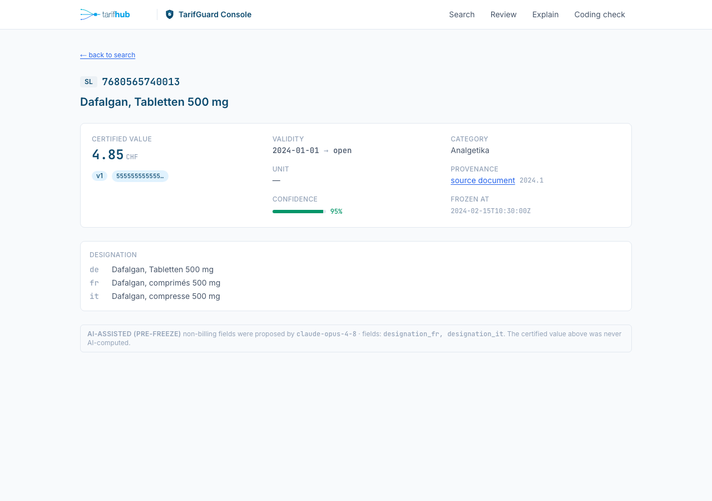
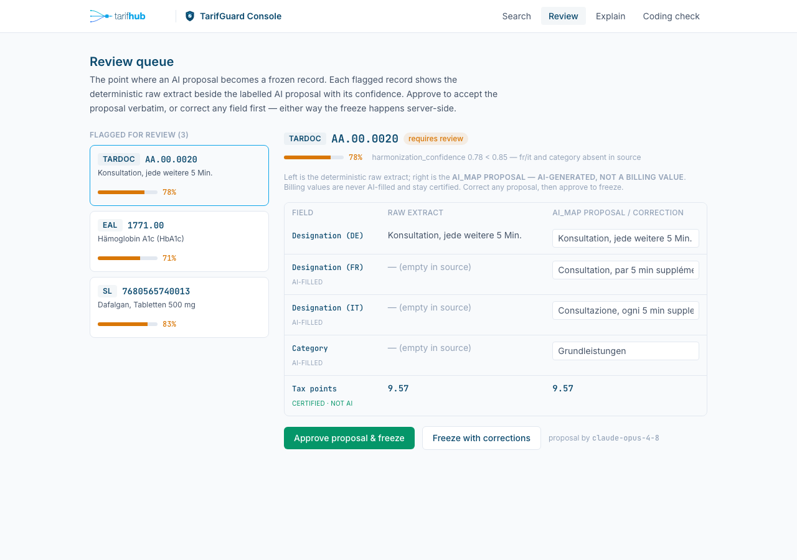
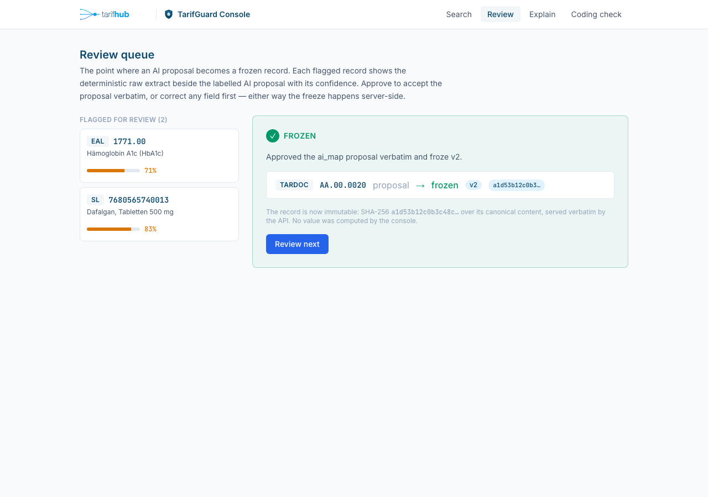
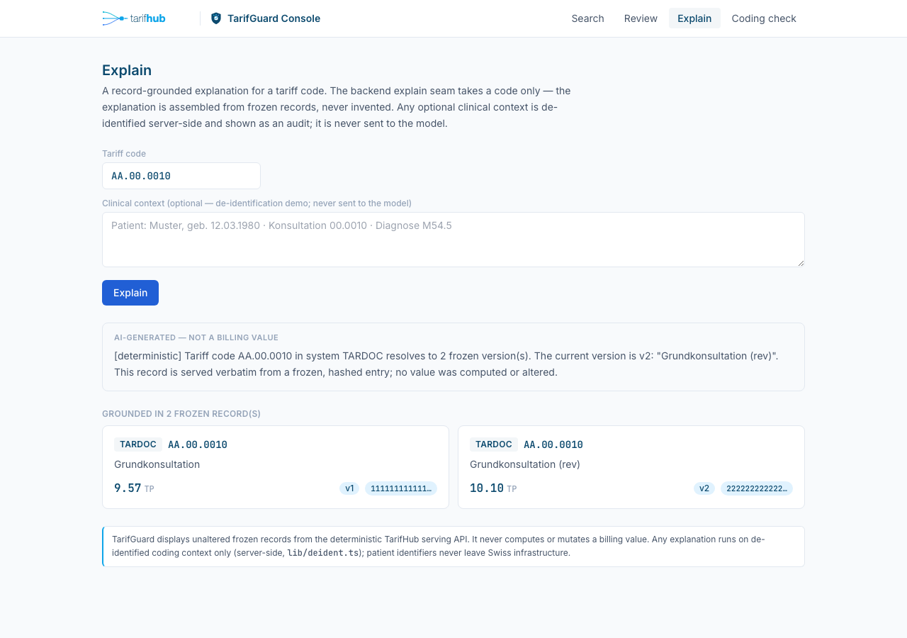

# Building Block View

## Level 0: system context

tarifhub ingests Swiss ambulatory tariff sources (BAG EAL XLSX, FHIR catalogues), harmonises them once pre-freeze, and serves immutable frozen records to humans (TarifGuard console), machines (REST/FHIR clients) and AI assistants (MCP). All consumers read from the same deterministic serving layer; nothing downstream of the freeze line writes.

## Level 1: containers

| Container | Repo path | Layer | Responsibility |
|-----------|-----------|-------|----------------|
| Ingestion service | `services/ingestion/` | L0 | AI-assisted harmonisation pipeline: load → parse → map → validate → score → flag → freeze → store → audit |
| Serving API (TarifCore) | `services/serving/` | L1 | Read-only REST: list/get tariffs (incl. `?as_of=` point-in-time), version diff, deterministic semantic search (pgvector on Postgres, in-process cosine offline, [ADR-017](../adr/017-deterministic-search-fallback-explain.md)), record-grounded `/api/v1/explain`, FHIR R4 read adapter (ChargeItemDefinition/CodeSystem); no write path, no LLM client importable (AST-tested) |
| MCP server (TarifMCP) | `services/mcp/` | L1 | `search_tariffs`, `get_tariff`, `explain_crosswalk`: read-only httpx proxies to the serving API, returning frozen records verbatim |
| TarifGuard console | `apps/tarifguard/` | L3 | Four surfaces over the serving API: master-detail search, frozen-record detail, a human review form (the one write path, backed by the ingestion review endpoint), and a labelled AI explain panel with server-side de-identification |
| Database | `db/` | n/a | PostgreSQL 16 + pgvector; `schema.sql` + forward-only migrations; the only contract between L0 and L1 |
| Deployment | `deploy/` | n/a | docker-compose + Helm/k3d; container-first distribution evidence |

L2 (intelligence: rules, crosswalk reasoning) is post-CAS scope as a *feature*: an offline-tested scaffold exists at `services/intelligence/` (TarifIQ: frozen rule table, combinability evaluation, TARMED↔TARDOC crosswalk), and the **graded MVP value path is L0 ingestion → L1 serving/MCP → L3 console**; L2 is not part of it. The scaffold is, however, packaged like every other sub-system (its own Dockerfile, compose service and Helm template), so it can be brought up alongside the stack for completeness; that deployment fact is shown in [§7](07-deployment-view.md). L2 stays read-only and post-freeze (it reads frozen facts from L1), so including its container never touches the value path.

> **Figure: The four layers and the freeze line.** A freeze-line-aware view of the same containers: the L0 ingestion pipeline above the line, and the L1 serving and MCP read paths, the L2 rules scaffold, and the L3 console below it. No AI runs on the value path below the line.

## Level 2: ingestion service components

The ingestion service is the only place where AI runs, and only at the `map` step, consistent with the value-path invariant: no AI computes or mutates a billing value at serve time.

| Component | Module (under `services/ingestion/src/tarifhub_ingest/`) | Responsibility |
|-----------|-----------------------------------------------------------|----------------|
| Adapters | `adapters/bag_eal.py`, `adapters/bag_epl.py` | Source-specific acquisition and parsing into raw rows: BAG EAL (XLSX) and the BAG ePL Spezialitätenliste (the specialty medicines list, FHIR R5 NDJSON, streamed and traversed inside the adapter, [ADR-015](../adr/015-epl-sl-fhir-ingestion.md)) |
| Parsers | `parsers/xlsx_parser.py` | Generic XLSX parsing into raw row dicts with a pinned parser version; the EAL and SL sources parse inside their own adapters, so there is no standalone FHIR parser module |
| Mapper | `mappers/tariff_mapper.py` (`map_raw`) | Deterministic mapping to the canonical `TariffRecord`; owns **all billing values** |
| `ai_map` seam | `mappers/tariff_mapper.py` (`ai_map`, `AIRefinement`) | The **only live-AI point in the system**: fill-only on non-billing fields, deterministic gap-gate decides whether to call at all, structured output via `messages.parse`, deterministic fallback to `map_raw` without an API key |
| Validator | `validators/tariff_validator.py` (`validate`, `ValidationResult`) | Schema and business-rule checks; failures fail closed into review |
| Confidence scorer | `confidence/scorer.py` (`score`) | Deterministic harmonisation-confidence score per record |
| Review routing | `ingestion/pipeline.py` (`requires_review`) | Flags records with confidence below `TARIFHUB_REVIEW_THRESHOLD` (default 0.85) or failed validation for human review |
| Freeze | `versioning/freeze_record.py` (`freeze`, `compute_record_hash`, `verify`) | SHA-256 `record_hash` over sorted canonical content; freezing an already-frozen record raises `ValueError`; updates are new versions |
| Audit | `audit/audit_logger.py` (`AuditLogger`) | Append-only lineage event per pipeline outcome |
| Embedder | `embeddings/embedder.py` (`Embedder` protocol, `HashingEmbedder`, `get_embedder`) | Search embeddings only, never on the value path; deterministic hashing stub offline |
| Repository | `storage/tariff_repository.py`, `storage/db.py` | Persistence of frozen records + embeddings; idempotent on `record_hash` |
| Pipeline orchestrator | `ingestion/pipeline.py` (`run_pipeline`) | Fixed stage order `load → parse → map → validate → score → flag → freeze → store → audit`; pure function of sorted inputs |

## Data model

Two tables. `tariff` holds immutable versioned rows: `UNIQUE(tariff_system, tariff_code, version)` makes versions explicit, `record_hash UNIQUE` (SHA-256 over sorted canonical content) is the integrity anchor and idempotency key, and `embedding vector(1024)` carries the pgvector HNSW cosine index for semantic search. `audit_log` is append-only lineage, keyed by `record_hash`: every freeze and skipped re-ingest leaves an event.

Canonical source of truth: `db/schema.sql` in the repository, mirrored in SQLite for offline tests. The field set is locked additive-only per [ADR-003](../adr/003-canonical-record-model.md); the Pydantic model (`models/tariff_model.py`, `TariffRecord`) is the same shape end-to-end.

## Level 3: TarifGuard console components

> **Figure: The console master-detail and the one write path.** Search opens the frozen-record detail and the labelled explain panel; the review form is the single place the console writes, and an approval is frozen server-side as a new version with a new record hash. Billing values are never AI-filled.

The TarifGuard console (`apps/tarifguard/`, Next.js App Router with React and Tailwind) is the platform's trust surface, and it computes nothing of its own: every billing value it shows is an unaltered frozen record relayed from the serving API. It has four components, scoped by [ADR-013](../adr/013-demo-scope.md). The master list (`/search`) runs semantic search (`GET /api/v1/search`) and code or system browse (`GET /api/v1/tariffs`); each result opens the detail panel (`/tariffs/{system}/{code}`), which renders the certified value with its version and truncated `record_hash` chips, the validity window, the source provenance link, the deterministic version history, and a crosswalk hint where the same code exists in another system. The explain panel (`/explain`) calls the deterministic `GET /api/v1/explain` with a tariff code only, and presents the record-grounded explanation on a clearly labelled AI surface. A small coding-check page, accepted in ADR-013 as a demo extra, looks up pasted positions structurally (existence, review flag, validity window) and computes no combinability verdict.

The review form (`/review`) is the human-in-the-loop made operable, and it is the one place the console writes. A flagged record (one whose `requires_review` flag is set) shows the deterministic raw extract beside the `ai_map` proposal, field by field, with the harmonisation confidence and the proposing model named. The reviewer approves the proposal verbatim or corrects any non-billing field, and the record is frozen server-side; the billing values (`tax_points`, `price_chf`) are never AI-filled and stay certified throughout. This write path goes through the console's own API route (`app/api/review`), never the database and never `freeze()` directly. The ingestion review endpoint behind `INGEST_BASE_URL` is implemented (`GET /review/queue`, `POST /review`, [ADR-013](../adr/013-demo-scope.md)): a decision flows console to ingestion `POST /review`, then deterministic `validate`, then `freeze`, then an append-only audit event, then a new immutable version, so an approved or corrected mapping becomes a real frozen successor (version + 1, new `record_hash`), and the same deterministic billing guard rejects any attempt to correct `tax_points` or `price_chf`. With `INGEST_BASE_URL` unset the route still serves a fixture queue offline and simulates the freeze with a genuine SHA-256 over the decided content, so the proposal-to-frozen transition is tangible without a backend; setting it switches to the live endpoint with no change to the UI.

Two boundaries are visible in the interface and enforced in code. The visual law (mirrored from `docs/brand/tokens.css`) renders every frozen value in navy JetBrains Mono with version and hash chips, and every AI output on a slate surface carrying its fixed guardrail label that it is not a billing value; the two are never blended in one element. The de-identification seam (ADR-012, `lib/deident.ts`) is the only sanctioned builder of any model-bound payload: the explain seam accepts a tariff code only, and any optional free-text context is scrubbed server-side and shown as an audit, never forwarded. Both boundaries are designed to be tested at the component level. Vitest component specs and an offline Playwright smoke (search to detail to a mocked review-freeze to explain, asserting in a real browser that frozen values resolve to navy and that the AI label is present) exist in the repository under `apps/tarifguard/tests` and `apps/tarifguard/e2e`, and they are wired to the `package.json` `test` script (`vitest run && playwright test`), which has run in CI since the console landed (PR #16). The CI `console` job (`.github/workflows/ci.yml`) runs `npm ci`, lint, build, installs Chromium, and then the suite: 18 Vitest tests across four files (all green) plus a Playwright end-to-end smoke (the gate runs 1 end-to-end test green and skips a `CAPTURE`-gated screenshot spec). The current state of console testing, with the quoted CI result, is detailed in [§13](13-test-strategy.md#console-component-tests).

### Console screenshots

Master list: search over frozen records, with certified values in navy mono and version plus hash chips.

Frozen-record detail: the certified value, provenance, multilingual designation, and the AI-assisted harmonisation disclosed as a labelled note, never as a value.

Review form: the raw extract beside the `ai_map` proposal, with billing values certified and excluded from AI editing.

The approve action, where a proposal becomes a frozen record with a new version and a real SHA-256 record hash.

Explain panel: a record-grounded explanation on the labelled AI surface; the input is a tariff code only.

