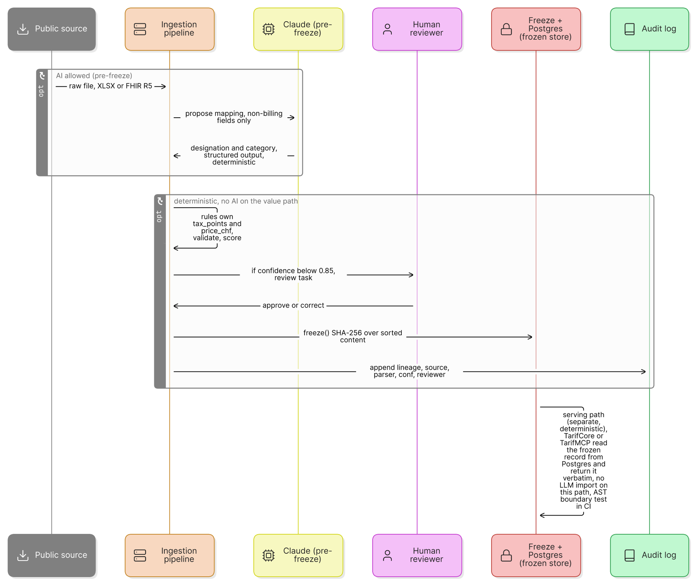
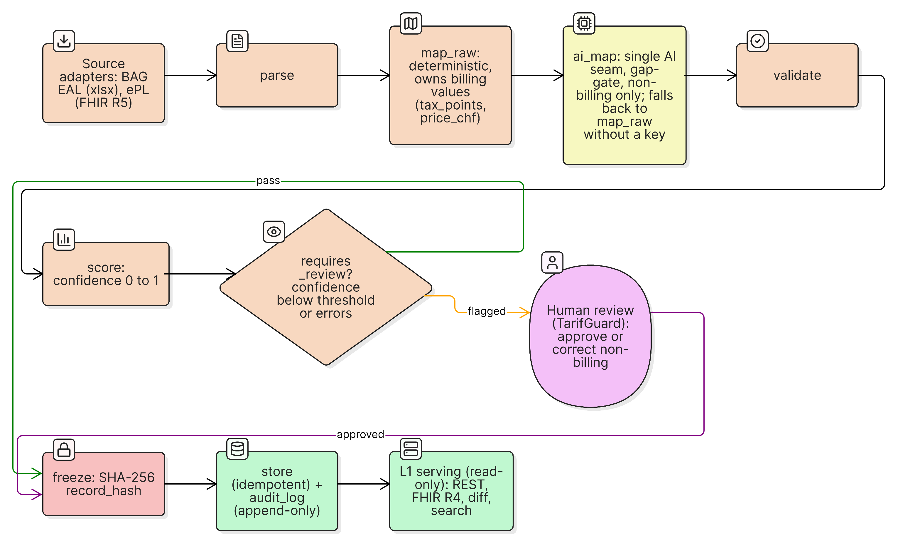
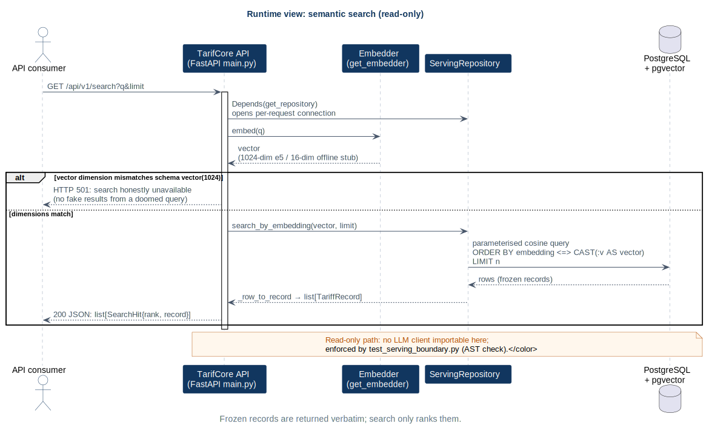
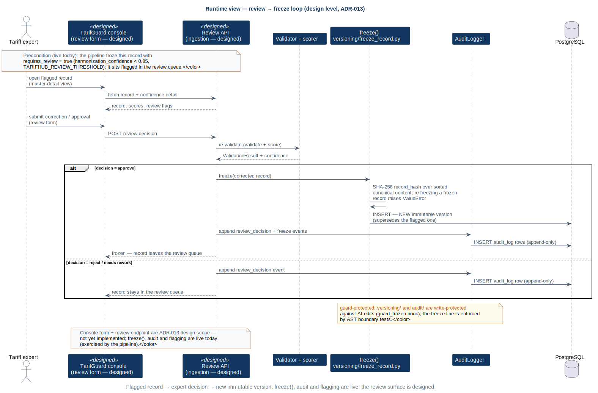
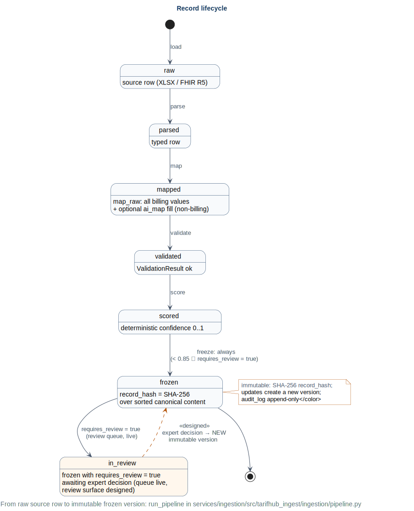

# 06 · runtime view

Three scenarios show the architecture at work: the deterministic harmonisation pipeline (live), semantic search through the serving API (live), and the expert review loop (design level, [ADR-013](../adr/013-demo-scope.md)). Each scenario is traceable to code under `services/`.

> **No AI computes or mutates a billing value at serve time.**

## Scenario 1: harmonise to freeze (the pipeline)

`run_pipeline` (`services/ingestion/src/tarifhub_ingest/ingestion/pipeline.py`) processes sources in a fixed order: **load → parse → map → validate → score → flag → freeze → store → audit**. It is a pure function of sorted inputs, with no randomness and no wall-clock branching, so the same sources always produce the same frozen records and hashes.

1. **Load + parse.** Source specs are sorted by system and path; the matching parser (`xlsx_parser`, `fhir_parser`, or the `bag_eal` adapter) yields raw rows.
2. **Map.** `ai_map` wraps the deterministic `map_raw`, which owns every billing-relevant field. The AI seam is **fill-only** (designation FR/IT, category, [ADR-005](../adr/005-single-ai-seam.md)): a deterministic gap-gate skips the model call entirely when nothing is fillable, and any failure or missing API key falls back to the `map_raw` result unchanged.
3. **Validate + score.** `validate` produces a `ValidationResult`; `score` computes a harmonisation confidence in [0, 1].
4. **Flag.** Confidence below `TARIFHUB_REVIEW_THRESHOLD` (default 0.85) or a validation failure sets `requires_review`; the record still freezes, carrying the flag into the review queue.
5. **Freeze.** `freeze` stamps the SHA-256 `record_hash` over sorted canonical content; attempting to re-freeze an already-frozen record raises `ValueError`.
6. **Store + audit.** The repository inserts the immutable row (skipping when the hash already exists) and `AuditLogger` appends one event per record: `freeze` or `freeze_skipped_idempotent`.
7. **Idempotency.** Re-running on identical sources yields an identical hash set, so every record is skipped and the audit trail records exactly that.

> **Figure: The end-to-end data flow.** Source adapters, parse, map_raw, the ai_map seam (gap-gated, non-billing fields only), validate, score, the review gate with its human-review branch, freeze with the SHA-256 record hash, the idempotent store and append-only audit, and the read-only serving hand-off.

## Scenario 2: semantic search through serving

`GET /api/v1/search` (`services/serving/src/tarifhub_serving/main.py`) ranks frozen records by cosine similarity to the embedded query. The path is strictly read-only and fails closed rather than degrading silently.

1. A client calls `GET /api/v1/search?q=…&limit=…`; FastAPI injects the repository and settings via dependency injection.
2. The query is embedded with `get_embedder().embed_query`, the same embedder seam ingestion used to embed the records (e5's asymmetric `query:`/`passage:` prefixes are honoured).
3. **Engine dispatch ([ADR-017](../adr/017-deterministic-search-fallback-explain.md)).** On Postgres, `ServingRepository.search_by_embedding` runs a parameterised pgvector cosine query (`<=>`) over frozen rows; on the offline SQLite mirror the same ranking runs as a **deterministic in-process cosine** over the stored stub embeddings, ties broken by `(tariff_system, tariff_code)`: same response shape, never a faked result.
4. **Dimension guard.** On Postgres, an embedder whose vector does not match the `vector(1024)` column fails closed with an explicit **501** before issuing the doomed pgvector query.
5. Rows are rehydrated verbatim into `TariffRecord` and returned as ranked `SearchHit` items; no field is recomputed or rewritten.
6. **Read-only guarantee.** The AST boundary test (`services/serving/tests/test_serving_boundary.py`) proves no LLM client is importable on this path; CI fails otherwise.

## Scenario 3: review to freeze loop (design level)

The console review form and its POST endpoint are **design scope ([ADR-013](../adr/013-demo-scope.md)), not yet implemented**. What is live today: the pipeline flags low-confidence records (`requires_review`), and `freeze` plus the append-only audit log are exercised on every run. The loop below describes how the designed pieces close the cycle.

1. The pipeline flags a record (confidence < 0.85 or validation failure); it freezes with `requires_review = true` and enters the review queue *(live)*.
2. A tariff expert opens the flagged record in the console master-detail view and corrects or approves the mapping in the review form *(designed)*.
3. The correction passes back through the same deterministic `validate`; an expert edit gets no shortcut around the rules *(designed)*.
4. `freeze` produces a **new version** with a new `record_hash`; the flagged version remains immutable and re-freezing it raises `ValueError` *(freeze live, trigger designed)*.
5. Audit events are appended for the review decision and the new freeze; the append-only `audit_log` keeps the full lineage *(audit live)*.
6. The new version carries `requires_review = false` and the record leaves the queue *(designed)*.

The freeze line itself is defended in depth: `versioning/` and `audit/` are write-protected against AI edits by the `guard_frozen` hook, and the boundary is CI-enforced by `test_determinism_boundary.py`.

## Record lifecycle (states)

A record moves **raw → parsed → mapped → validated → scored → frozen**, with flagged records (`requires_review`) entering the review queue as frozen versions; frozen is terminal and immutable, so every correction is a new version and every transition an audit event.
