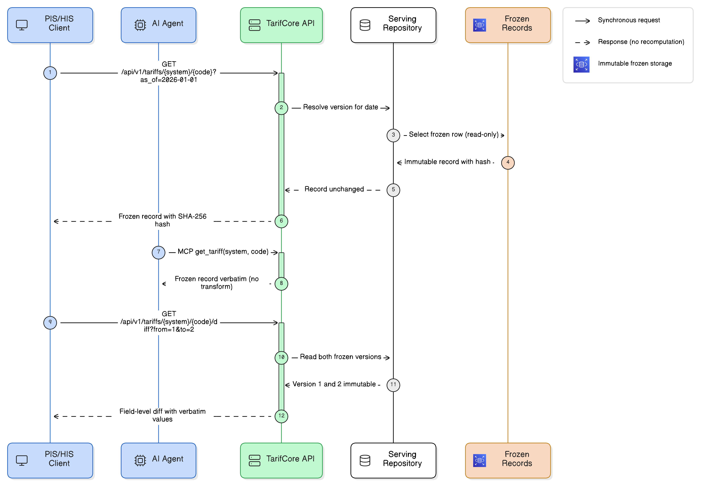

# Runtime View

Three scenarios show the architecture at work: the deterministic harmonisation pipeline (live), semantic search through the serving API (live), and the expert review loop (design level, [ADR-013](../adr/013-demo-scope.md)). Each scenario is traceable to code under `services/`.

> **No AI computes or mutates a billing value at serve time.**

## Scenario 1: harmonise to freeze (the pipeline)

`run_pipeline` (`services/ingestion/src/tarifhub_ingest/ingestion/pipeline.py`) processes sources in a fixed order: **load → parse → map → validate → score → flag → freeze → store → audit**. It is a pure function of sorted inputs, with no randomness and no wall-clock branching, so the same sources always produce the same frozen records and hashes.

1. **Load + parse.** Source specs are sorted by system and path; a parser is dispatched per source kind (`_PARSERS` in `pipeline.py`): `xlsx_parser` for the generic XLSX kind, the `bag_eal` adapter for the EAL source, and the `bag_epl` adapter for the SL FHIR R5 export ([ADR-015](../adr/015-epl-sl-fhir-ingestion.md)), which streams and traverses the resource graph itself. Each yields raw rows with a pinned parser or adapter version.
2. **Map.** `ai_map` wraps the deterministic `map_raw`, which owns every billing-relevant field. The AI seam is **fill-only** (designation FR/IT, category, [ADR-005](../adr/005-single-ai-seam.md)): a deterministic gap-gate skips the model call entirely when nothing is fillable, and any failure or missing API key falls back to the `map_raw` result unchanged.
3. **Validate + score.** `validate` produces a `ValidationResult`; `score` computes a harmonisation confidence in [0, 1].
4. **Flag.** Confidence below `TARIFHUB_REVIEW_THRESHOLD` (default 0.85) or a validation failure sets `requires_review`; the record still freezes, carrying the flag into the review queue.
5. **Freeze.** `freeze` stamps the SHA-256 `record_hash` over sorted canonical content; attempting to re-freeze an already-frozen record raises `ValueError`.
6. **Store + audit.** The repository inserts the immutable row (skipping when the hash already exists) and `AuditLogger` appends one event per record: `freeze` or `freeze_skipped_idempotent`.
7. **Idempotency.** Re-running on identical sources yields an identical hash set, so every record is skipped and the audit trail records exactly that.

> **Figure: The end-to-end data flow.** Source adapters, parse, map_raw, the ai_map seam (gap-gated, non-billing fields only), validate, score, and the requires_review flag, then a deterministic freeze (every record freezes, the flag carried, never gated by a human) with the SHA-256 record hash, the idempotent store and append-only audit, and the read-only serving hand-off. Flagged frozen records enter the review queue, where a human review creates a new version.

## Scenario 2: semantic search through serving

`GET /api/v1/search` (`services/serving/src/tarifhub_serving/main.py`) ranks frozen records by cosine similarity to the embedded query. The path is strictly read-only and fails closed rather than degrading silently.

1. A client calls `GET /api/v1/search?q=…&limit=…`; FastAPI injects the repository and settings via dependency injection.
2. The query is embedded with `get_embedder().embed_query`, the same embedder seam ingestion used to embed the records (e5's asymmetric `query:`/`passage:` prefixes are honoured).
3. **Engine dispatch ([ADR-017](../adr/017-deterministic-search-fallback-explain.md)).** On Postgres, `ServingRepository.search_by_embedding` runs a parameterised pgvector cosine query (`<=>`) over frozen rows; on the offline SQLite mirror the same ranking runs as a **deterministic in-process cosine** over the stored stub embeddings, ties broken by `(tariff_system, tariff_code)`: same response shape, never a faked result.
4. **Dimension guard.** On Postgres, an embedder whose vector does not match the `vector(1024)` column fails closed with an explicit **501** before issuing the doomed pgvector query.
5. Rows are rehydrated verbatim into `TariffRecord` and returned as ranked `SearchHit` items; no field is recomputed or rewritten.
6. **Read-only guarantee.** The AST boundary test (`services/serving/tests/test_serving_boundary.py`) proves no LLM client is importable on this path; CI fails otherwise.

## Scenario 3: review to freeze loop (design level)

The console review form and its POST endpoint are **design scope ([ADR-013](../adr/013-demo-scope.md)), not yet implemented**. What is live today: the pipeline flags low-confidence records (`requires_review`), and `freeze` plus the append-only audit log are exercised on every run. The loop below describes how the designed pieces close the cycle.

1. The pipeline flags a record (confidence < 0.85 or validation failure); it freezes with `requires_review = true` and enters the review queue *(live)*.
2. A tariff expert opens the flagged record in the console master-detail view and corrects or approves the mapping in the review form *(designed)*.
3. The correction passes back through the same deterministic `validate`; an expert edit gets no shortcut around the rules *(designed)*.
4. `freeze` produces a **new version** with a new `record_hash`; the flagged version remains immutable and re-freezing it raises `ValueError` *(freeze live, trigger designed)*.
5. Audit events are appended for the review decision and the new freeze; the append-only `audit_log` keeps the full lineage *(audit live)*.
6. The new version carries `requires_review = false` and the record leaves the queue *(designed)*.

The freeze line itself is defended in depth: `versioning/` and `audit/` are write-protected against AI edits by the `guard_frozen` hook, and the boundary is CI-enforced by `test_determinism_boundary.py`.

## Record lifecycle (states)

A record moves **raw → parsed → mapped → validated → scored → frozen**, with flagged records (`requires_review`) entering the review queue as frozen versions; frozen is terminal and immutable, so every correction is a new version and every transition an audit event.

## Interface-contract view (the interaction perspective)

The scenarios above show specific behaviours; this view generalises them into the contract every consumer codes against. The interaction perspective is carried by the L1 serving surface itself: the set of typed, read-only operations through which PIS/HIS systems (REST and FHIR R4), AI agents (MCP) and the TarifGuard console reach frozen records. It is enforced by tests rather than asserted in prose, and it is the same surface for every consumer class, so the freeze-line guarantee holds identically whoever calls.

> **Figure: The interface contract in motion.** A point-in-time read over REST (the FHIR R4 ChargeItemDefinition adapter resolves the same way over the same value path), a record fetched verbatim over MCP (`get_tariff`), and a version diff, each served through the read-only repository from immutable frozen storage. The verbatim reads return the stored record unchanged with its canonical SHA-256 hash; `diff` returns the field-level changes between two immutable versions; no billing value is recomputed on the way out.

### The serving surface as a contract

| Interface | Operation | Request contract | Response contract |
| --- | --- | --- | --- |
| REST | `GET /api/v1/tariffs` | `system?`, `as_of?`, `limit`, `offset` | `list[TariffRecord]`, one per key, ordered by `(tariff_system, tariff_code)` |
| REST | `GET /api/v1/tariffs/{system}/{code}` | `as_of?` | `TariffRecord` (latest or point-in-time); `404` if no version matches |
| REST | `GET /api/v1/tariffs/{system}/{code}/diff` | `from`, `to` (versions) | `DiffResponse`: changed fields only, sorted by name; `record_hash`, `version`, `created_at` are never diffed; `404` if either version is missing |
| REST | `GET /api/v1/explain` | `code`, `system?` | `ExplainResponse`: every version of the code plus a rule-generated explanation labelled `[deterministic]`; `404` if unknown |
| REST | `GET /api/v1/search` | `q`, `limit` | `list[SearchHit]`: frozen records ranked by cosine similarity; `501` on Postgres when the embedder is not 1024-dim |
| FHIR R4 | `GET /api/v1/fhir/ChargeItemDefinition/{system}/{code}` | `version?` (wins over) `as_of?` | one R4 `ChargeItemDefinition`; `status` is derived from record data, never the wall-clock; `404` if no record matches |
| FHIR R4 | `GET /api/v1/fhir/CodeSystem/{system}` | `as_of?`, `limit`, `offset` | one R4 `CodeSystem` (`content='fragment'`, `count` is the total number of keys for the selected point in time, independent of the page window); `404` for an unknown or empty system |
| MCP | `search_tariffs`, `get_tariff`, `explain_crosswalk` | read-only tool arguments | read-only `httpx` proxies onto the REST surface: `get_tariff` returns a frozen record verbatim, `search_tariffs` returns ranked `SearchHit` wrappers, `explain_crosswalk` returns the `explain` payload (records plus the deterministic explanation) |
| Liveness | `GET /health` | none | `{"status": "ok"}` |

**Point-in-time, versioning and diff are part of the contract.** The list and single-record reads, and both FHIR adapters, accept an optional `as_of` date and return, per key, the version whose validity window covers that date (`valid_from <= as_of`, and `valid_to` open or on or after `as_of`, then the highest matching version); omitting `as_of` returns the latest version. The `ChargeItemDefinition` route additionally accepts an exact `version`, which wins over `as_of`. Versions are explicit and immutable (`UNIQUE(tariff_system, tariff_code, version)`), so a correction is always a new version, and `diff` reports exactly which fields changed between any two of them (`record_hash`, `version` and `created_at` are excluded from the comparison). A point-in-time query means the same thing whether a consumer reads over REST or the FHIR adapter, because both resolve it over the one immutable version history.

### The machine-readable contract is tested, not asserted

The contract is not only narrated here. FastAPI derives an OpenAPI document from the typed route signatures (served at `/openapi.json`, rendered at `/docs`), and `services/serving/tests/test_openapi.py` pins it: the test fixes the exact route surface and fails if a route is added, removed or renamed without an update, and it requires every route to carry an OpenAPI summary, a description and a response model. The acceptance criterion behind it (see [§10, acceptance criteria](10-quality-requirements.md#acceptance-criteria)) therefore cannot erode one undocumented route at a time.

### Determinism is a property of the interface

The contract never recomputes or fabricates a billing value. The billing fields a consumer receives are unaltered, frozen, versioned values read straight from the system of record; the read-only seams around them are deterministic transforms, never value computation: `search` only ranks frozen rows and never rewrites them, `explain` assembles a rule-generated text labelled `[deterministic]` from record fields alone, the FHIR adapters project a frozen record into an R4 resource without touching its values, and a dimension mismatch on `search` fails closed with `501` rather than degrade silently ([ADR-017](../adr/017-deterministic-search-fallback-explain.md)). That no LLM client is even importable on this path is proved structurally by the AST boundary test `services/serving/tests/test_serving_boundary.py`, which CI enforces. The interface is therefore safe to integrate against: no value on it is computed from randomness or the wall-clock, the record fields it returns are the frozen values verbatim, and every frozen record it exposes carries the canonical-content SHA-256 hash that pins its integrity.
