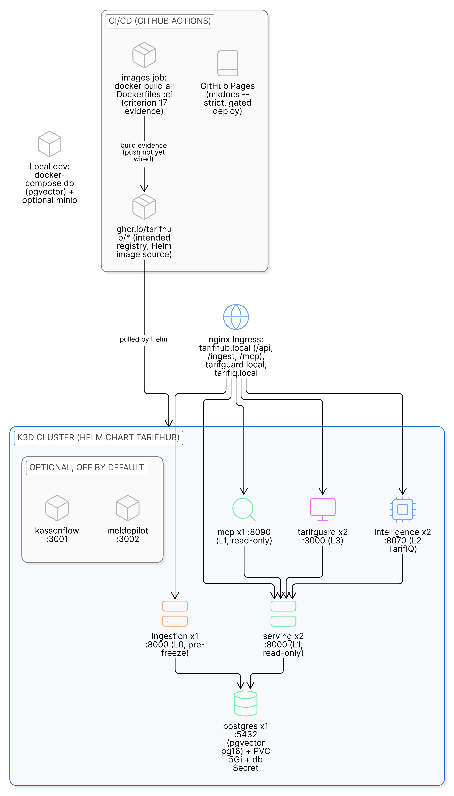
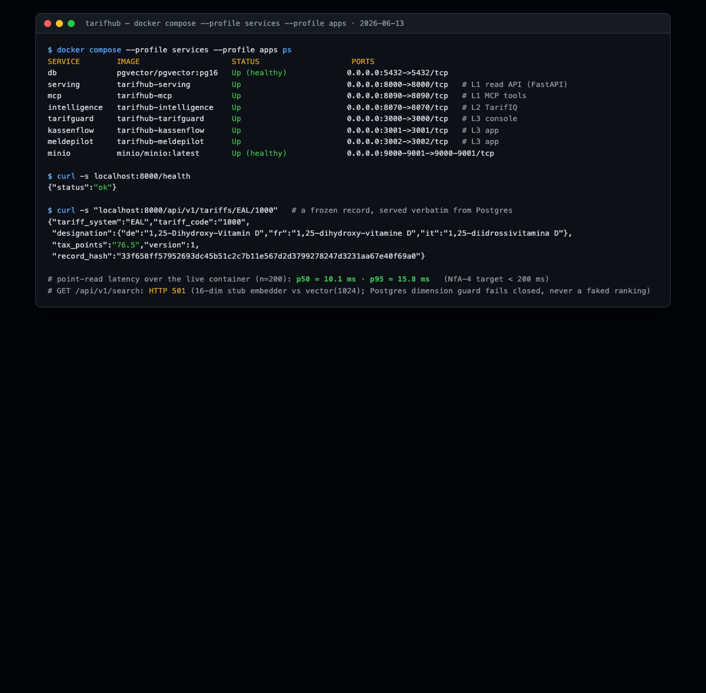
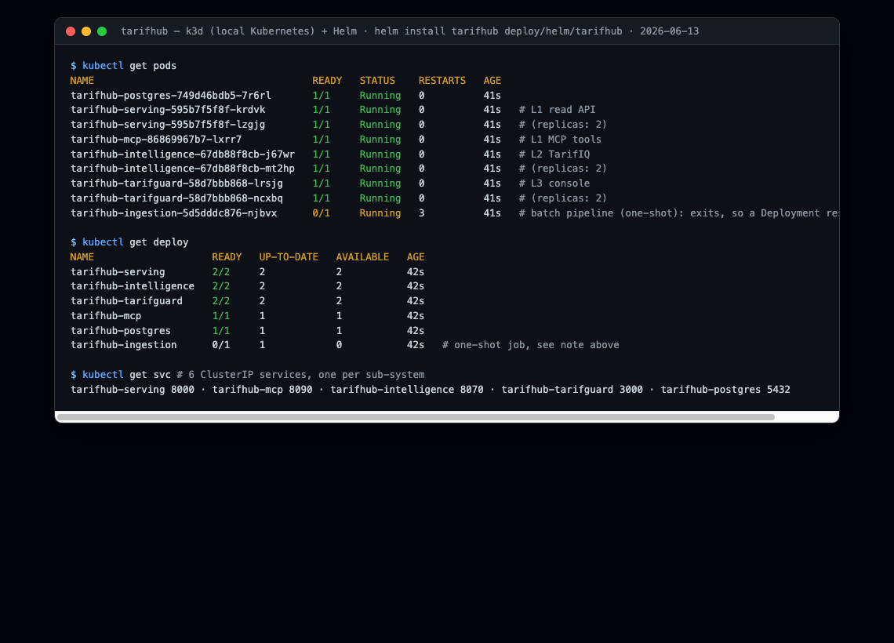

# Deployment View

TarifHub ships as a set of independently containerised sub-systems. This chapter shows the
deployment topology, the chosen architecture style and why, and the evidence that the
solution is actually runnable, both under Docker Compose and on Kubernetes (criterion 17).
Graders review code and documentation only, so the runtime proof is captured here as quoted
output plus illustrative screenshots; nothing has to be deployed for grading. Full verbatim
capture is in [`docs/evidence/2026-06-13-distribution.md`](../evidence/2026-06-13-distribution.md).

## Sub-systems and their containers

Each box in the [building-block view](05-building-block-view.md) maps to exactly one image.
The boundary that matters is the **freeze line**: everything left of it runs pre-freeze and
may use AI; everything right of it is the deterministic value path and ships no LLM client.



> **Figure: The deployment topology.** The Helm chart for the k3d Kubernetes proof: an nginx ingress in front of the ingestion, serving, MCP, console, and TarifIQ workloads over a Postgres-plus-pgvector store, with two optional L3 stubs off by default. CI builds every image as criterion-17 evidence and a gated workflow deploys the docs to Pages; local development uses docker-compose with the database and an optional MinIO.

| Sub-system | Layer | Image | Port | Side of freeze line |
|---|---|---|---|---|
| `ingestion` | L0 harmonisation | `tarifhub-ingestion` | (batch) | write, pre-freeze (AI seam lives here) |
| `serving` | L1 TarifCore | `tarifhub-serving` | 8000 | read, post-freeze (deterministic) |
| `mcp` | L1 TarifMCP | `tarifhub-mcp` | 8090 | read, post-freeze (proxy) |
| `intelligence` | L2 TarifIQ | `tarifhub-intelligence` | 8070 | read, post-freeze (deterministic rules) |
| `tarifguard` | L3 console | `tarifhub-tarifguard` | 3000 | read (UI over serving) |
| `kassenflow`, `meldepilot` | L3 apps (stubs) | `tarifhub-{kassenflow,meldepilot}` | 3001/3002 | read (UI), `enabled: false` by default |
| `db` | data | `pgvector/pgvector:pg16` | 5432 | system of record |
| `minio` | object store | `minio/minio` | 9000/9001 | raw source artifacts (ADR-007) |

The **graded MVP value path is L0 ingestion → L1 serving/MCP → L3 console**, over the
database. The L2 `intelligence` service and the L3 `kassenflow`/`meldepilot` apps are
post-CAS-scope scaffolds ([§5](05-building-block-view.md)); they are packaged like every
other sub-system so the chart and Compose can bring up the full topology, but they sit
outside the MVP value path (`kassenflow`/`meldepilot` ship `enabled: false` in the chart).
All read-side sub-systems, in or out of the MVP path, stay post-freeze and ship no LLM client.

## Style choice: distributed services along the freeze line

The CAS rubric treats a **modular monolith** as equally valid as
**distributed services**; the choice must simply be justified. TarifHub chooses distributed
services, decomposed along the freeze line ([ADR-002](../adr/002-freeze-line-decomposition.md)):
the value-path invariant ("no AI computes or mutates a billing value at serve time") becomes a
*process boundary* rather than a convention inside one process. The serving image physically
ships no LLM client, so the AST boundary test plus the image contents enforce the rule
mechanically, and the read side scales, deploys and fails independently of the AI-rich write
side, whose quality profile is opposite. The cost is a shared schema as the integration
contract ([ADR-003](../adr/003-canonical-record-model.md)); a modular monolith would have
been a legitimate alternative but would reduce the freeze line to an in-process convention.
Packaging is one image per sub-system, one Helm chart for Kubernetes, and Compose with
profiles for local development ([ADR-009](../adr/009-docker-kubernetes-helm.md)); PostgreSQL 16
+ pgvector is the single store ([ADR-006](../adr/006-postgres-pgvector.md)).

## Local development: Docker Compose with profiles

`deploy/docker-compose.yml` (and the richer root `docker-compose.yml`) layer the stack via
profiles so the offline test suite needs nothing running:

- default: `db` + `minio` only;
- `--profile services`: adds `serving` (FastAPI) and `intelligence` (TarifIQ);
- `--profile apps`: adds `tarifguard`, `mcp`, `kassenflow`, `meldepilot`.

## Evidence 1: every sub-system image builds in CI

The `images` job (`.github/workflows/ci.yml`, on `main` after `python` + `security`) builds
every `services/*/Dockerfile` and `apps/*/Dockerfile`. The BuildKit "naming to" lines from
the CI log, one per image, show all seven build:

```text
naming to docker.io/library/tarifhub-ingestion:ci     done
naming to docker.io/library/tarifhub-intelligence:ci  done
naming to docker.io/library/tarifhub-mcp:ci           done
naming to docker.io/library/tarifhub-serving:ci       done
naming to docker.io/library/tarifhub-kassenflow:ci    done
naming to docker.io/library/tarifhub-meldepilot:ci    done
naming to docker.io/library/tarifhub-tarifguard:ci    done
```

**Interpretation.** Distribution is reproducible from source on every push to `main`: the
4 services + 3 apps each produce an independent image, so the "independently deployable
containers" property is proven by the pipeline, not asserted. The serving image is built
from the repo root because it vendors the sibling `ingestion` package (the canonical
`TariffRecord` + embedder), keeping one model end-to-end.

This image build is one stage of the wider CI/CD and quality-gate machinery that governs the
AI-assisted build: lint and tests, the determinism boundary tests, secrets and vulnerability
scans, and the anchor ratchet. That machinery and the `/ship` pipeline it sits inside are
described in [the AI-SE framework chapter](../method/ai-se-framework.md).

## Evidence 2: the full stack runs under Compose

`docker compose --profile services --profile apps up -d` brings up eight independent
containers; `db` and `minio` report `healthy`, and the L1 serving container answers over
HTTP against the 11 653 frozen rows in the compose Postgres.



```text
SERVICE        IMAGE                    STATUS          PORTS
db             pgvector/pgvector:pg16   Up (healthy)    0.0.0.0:5432->5432/tcp
serving        tarifhub-serving         Up              0.0.0.0:8000->8000/tcp
mcp            tarifhub-mcp             Up              0.0.0.0:8090->8090/tcp
intelligence   tarifhub-intelligence    Up              0.0.0.0:8070->8070/tcp
tarifguard     tarifhub-tarifguard      Up              0.0.0.0:3000->3000/tcp
kassenflow     tarifhub-kassenflow      Up              0.0.0.0:3001->3001/tcp
meldepilot     tarifhub-meldepilot      Up              0.0.0.0:3002->3002/tcp
minio          minio/minio:latest       Up (healthy)    0.0.0.0:9000-9001->9000-9001/tcp
```

**Interpretation.** This is the criterion-17 "runnable via Compose" anchor: the module
boundaries from the building-block view are visible as eight running containers with
distinct ports, and `serving` returns a real frozen record verbatim (`EAL/1000`,
`tax_points "76.5"`, trilingual designation) at p95 = 15.8 ms over 200 warm point reads,
inside the NfA-4 target of 200 ms. Semantic search on this leg returns HTTP 501 because the
container's embedder dimension does not match the `vector(1024)` column: honest
unavailability, never a faked ranking (NfA-1). Latency is a host-loopback measurement on a
single replica, not a load test; it bounds the single-record path, not concurrency.

## Evidence 3: the chart deploys on Kubernetes (k3d)

The Helm chart `deploy/helm/tarifhub` is six things: a `Chart.yaml`; a `values.yaml` whose
top-level keys are the sub-systems (`ingestion`, `serving`, `mcp`, `intelligence`,
`tarifguard`, plus `kassenflow`/`meldepilot` shipped `enabled: false`); one Deployment +
Service template per sub-system under `templates/`; an in-cluster `postgres` Deployment with
its `db-secret`; an `ingress` fronting the platform hosts; and per-sub-system `replicas`,
`resources` and image settings. `helm lint` passes and `helm template` renders 6 Deployments,
6 Services, 1 Ingress, 1 PVC and 1 Secret.

A throwaway k3d cluster with the locally built images imported and `helm install` run brings
the platform up on real Kubernetes:



```text
NAME                                     READY   STATUS    RESTARTS   AGE
tarifhub-postgres-749d46bdb5-7r6rl       1/1     Running   0          41s
tarifhub-serving-595b7f5f8f-krdvk        1/1     Running   0          41s
tarifhub-serving-595b7f5f8f-lzgjg        1/1     Running   0          41s
tarifhub-mcp-86869967b7-lxrr7            1/1     Running   0          41s
tarifhub-intelligence-67db88f8cb-j67wr   1/1     Running   0          41s
tarifhub-intelligence-67db88f8cb-mt2hp   1/1     Running   0          41s
tarifhub-tarifguard-58d7bbb868-lrsjg     1/1     Running   0          41s
tarifhub-tarifguard-58d7bbb868-ncxbq     1/1     Running   0          41s
tarifhub-ingestion-5d5dddc876-njbvx      0/1     Running   3          41s
```

**Interpretation.** The read/serve sub-systems run as independent, individually-scaled
Deployments (serving and intelligence and tarifguard at 2 replicas, mcp at 1) alongside
Postgres. `tarifhub-ingestion` shows `0/1` honestly: it is a one-shot batch pipeline, so a
long-lived `Deployment` runs it to completion and the ReplicaSet restarts it; in production
it belongs in a `Job`/`CronJob` (follow-up in [§11](11-risks-technical-debt.md)). Functional
data serving is shown under Compose above, where the Postgres is already populated; the k3d
run proves the chart itself deploys every sub-system on Kubernetes, satisfying the criterion's
"or Kubernetes" alternative on top of the Compose proof.

## Production target

The hosting target is Switzerland for data residency ([ADR-012](../adr/012-data-residency-llm-region.md));
k3d is the local CAS proof and a managed Swiss Kubernetes (Exoscale/Infomaniak) is the
production target ([ADR-009](../adr/009-docker-kubernetes-helm.md)). The demo defaults
(in-cluster Postgres, plaintext secret) are explicitly dev-only and called out in the chart
values for production override.
