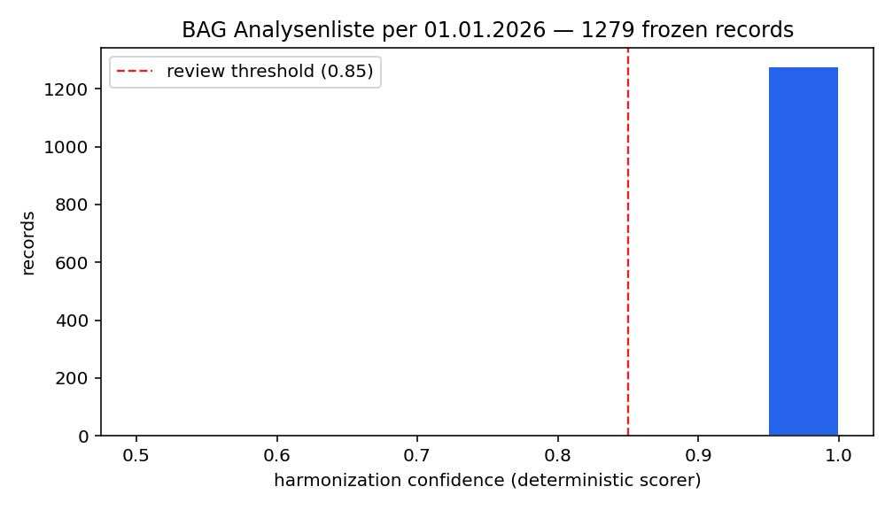
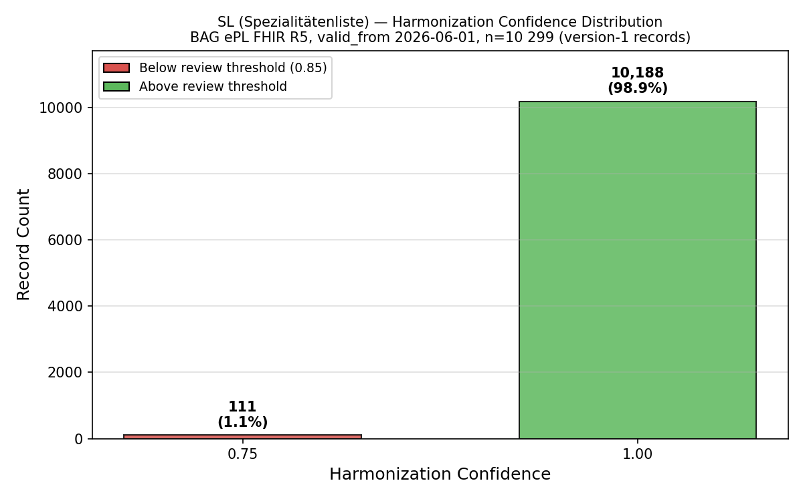

# Quality Requirements

## Quality goals (SMART NFRs)

Targets from Architecture v2.1 §12, carried as stable ids NfA-1…NfA-6; each row gives four columns, **Target value**, **Measurement method** (how it is measured), **Measured** (the observed value), and the governing **ADR**, and is validated against the measured runs below.

| NfA | Attribute | Target value | Measurement method | Measured | ADR |
|---|---|---|---|---|---|
| NfA-1 | Determinism | 100% of value-serving responses are frozen records; LLM-free value path | AST boundary tests (`test_serving_boundary.py`, `test_determinism_boundary.py` ×2) run per service in the offline suite and in CI's per-service test loop on every push; the ingestion + serving value-path suites re-run as a named, `-v`-visible CI step | Green on every CI run (per-service loop + named step in `.github/workflows/ci.yml` `python` job) | [ADR-002](../adr/002-freeze-line-decomposition.md), [ADR-005](../adr/005-single-ai-seam.md) |
| NfA-2 | Reproducibility | Identical sources → identical `record_hash` set, unconditionally (live key or not); `--refill` the deliberate exception; stored bytes == hashed bytes | Full re-ingest of the identical export + the live fill-reuse leg with a deliberately invalid API key | 0/10 299 frozen on the reuse leg (zero-API proof, [`docs/evidence/2026-06-12-sl-live-ingest.md`](../evidence/2026-06-12-sl-live-ingest.md)); zero duplicate hashes | [ADR-005 addendum](../adr/005-single-ai-seam.md), [ADR-016](../adr/016-decimal-scale-contract.md) |
| NfA-3 | Harmonisation review rate | <15% flagged on the two BAG sources | `PipelineReport` flagged/frozen ratio on full live ingests, cross-checked against `audit_log` | EAL 0.0 % (1 279), SL 1.08 % (111/10 299), runs 2026-06-11 | [ADR-005](../adr/005-single-ai-seam.md) (confidence scoring), [ADR-013](../adr/013-demo-scope.md) (review loop scope) |
| NfA-4 | API read latency | p95 < 200 ms single-record (cached), < 500 ms search | p95 over repeated requests against the live compose serving container | **single-record measured 2026-06-13**: p95 **15.8 ms** (p50 10.1 ms) over n=200 warm reads against the running container, well inside the 200 ms target; search-latency method-defined (see [§7](07-deployment-view.md#evidence-2-the-full-stack-runs-under-compose)) | [ADR-002](../adr/002-freeze-line-decomposition.md) (read side isolated), [ADR-006](../adr/006-postgres-pgvector.md) (point-read store) |
| NfA-5 | Freshness | New source version frozen + served within 24 h of publication | Pipeline wall clock of full live ingests as the bounding proxy | EAL 70.6 s, SL 574 s end-to-end incl. embeddings, both orders of magnitude inside 24 h | n/a |
| NfA-6 | Test coverage | Core modules > 80% line coverage | `pytest-cov` line coverage, printed by the CI `python` job on every run (report-only by owner decision, see [§13](13-test-strategy.md)) | **measured 2026-06-20**: serving 97 %, mcp 91 %, ingestion 91 % totals; every core module above the 80 % target (model / freeze / pipeline / validator 100 %, mapper 98 %, serving routes 100 %, review write-back 93 %, error layer 99 %), quoted in [Test and pipeline results](#test-and-pipeline-results) | report-only floor, gate-01 owner decision (see [§13](13-test-strategy.md)) |

The section below documents measured harmonisation evidence for the determinism, reproducibility and review-rate rows (EAL run 2026-06-11: 1 279/1 279 frozen, review rate 0.0 %; SL run 2026-06-11: 10 299 frozen, review rate 1.08 %, with a measured reproducibility caveat on the 47 AI-gap records, see below).

## Test and pipeline results

This section documents the test and pipeline output that the NfA table above is built
on, quoted verbatim from the offline suite and the CI pipeline and then interpreted.
This is deliberate: a screenshot or an unbacked "all tests green" claim says little, so the
pipeline output is quoted verbatim and interpreted here. The numbers
below are the interpretation; the CI link and the screenshots in [§7](07-deployment-view.md)
only illustrate. The pipeline figures were produced on 2026-06-13; the offline test counts and coverage tables below were re-run on
2026-06-20, after the review write-back and the uniform error-handling work landed, with the
headline coverage totals (ingestion 91 %, serving 97 %, mcp 91 %) unchanged from the prior
2026-06-19 measurement. The offline figures are
reproducible with `uv run pytest` in each service (no network, no container, no API key).

### Unit and contract tests (offline suite)

```text
ingestion:    192 passed, 3 skipped in 3.08s
serving:      102 passed, 1 skipped in 0.71s
mcp:          8 passed in 0.16s
intelligence: 28 passed in 0.23s
```

**Interpretation.** 330 tests pass and 4 are skipped (the skips are the Postgres-only
parity legs that have no `TARIFHUB_PG_TEST_URL` offline; they run in the `python-parity`
CI job against a real pgvector container). What this proves: the core logic, **including
its error cases**, runs green in the build. The error-case coverage is
concrete, not incidental: the validator rejects an empty key, an empty canonical German
designation and an inverted validity window (`test_validator.py`); the mapper's coercers
fail closed to `None` on unparseable money, a `bool`, or a non-ISO date rather than guess
(`test_mapper_coercion.py`); the freeze hash refuses a double-freeze and `verify` returns
`False` for an unfrozen record (`test_freeze_record.py`); the DB facades reject an
unsupported URL scheme (`test_storage_db.py`, `test_serving_db.py`); and the pgvector
search method refuses to run on SQLite rather than fake a ranking, so the `/search`
endpoint falls back to the deterministic in-process cosine instead (`test_repository.py`,
with the offline ranking and the Postgres dimension-guard 501 pinned in `test_api.py`). What this
output **excludes** by design: it is the offline suite, so it does not exercise live
Claude output (tested separately, see the AI-component tests in [§13](13-test-strategy.md))
or the real Postgres engine (the `python-parity` job).

### Coverage (pytest-cov, line coverage)

Measured locally on 2026-06-20 (ingestion 91 %, serving 97 %, mcp 91 %); line coverage is
platform-independent, so the same offline test set yields the same per-module coverage on
the CI Linux `python` job.

```text
# services/ingestion: uv run --extra dev pytest --cov=tarifhub_ingest
src/tarifhub_ingest/models/tariff_model.py              41      0   100%
src/tarifhub_ingest/versioning/freeze_record.py         40      0   100%
src/tarifhub_ingest/ingestion/pipeline.py               63      0   100%
src/tarifhub_ingest/mappers/tariff_mapper.py           121      2    98%
src/tarifhub_ingest/validators/tariff_validator.py      28      0   100%
src/tarifhub_ingest/storage/db.py                       35      4    89%
src/tarifhub_ingest/storage/tariff_repository.py        73      3    96%
src/tarifhub_ingest/review.py                          153     11    93%
src/tarifhub_ingest/errors.py                           81      1    99%
TOTAL                                                 1597    138    91%

# services/serving: uv run --extra dev pytest --cov=tarifhub_serving
src/tarifhub_serving/main.py            83      0   100%
src/tarifhub_serving/errors.py          69      1    99%
src/tarifhub_serving/repository.py     136      8    94%
src/tarifhub_serving/explain.py         35      0   100%
src/tarifhub_serving/fhir.py           104      1    99%
src/tarifhub_serving/models.py          25      0   100%
TOTAL                                  493     14    97%

# services/mcp: uv run --extra dev pytest --cov=server --cov=config
config.py      17      0   100%
server.py      28      4    86%
TOTAL          45      4    91%
```

**Interpretation.** Every named core module is well above the NfA-6 target of 80 %: the
model, freeze, pipeline and validator are at 100 %, the mapper at 98 %, the serving routes
(`main`) at 100 % and the read repository at 94 %. The two modules added since the last
measurement clear the floor comfortably: the human-review write-back (`review.py`) at 93 %
and the centralised error layer (`errors.py`) at 99 %. The residual misses are bounded and
named, not blind spots: the four uncovered lines in each `db.py` are the Postgres
`connect()` legs that require a live driver and server (exercised in the `python-parity`
CI job, not offline), the two mapper lines are the `import anthropic` guard that the
AI seam falls back from when the optional extra is absent, the eleven `review.py` lines are
individual non-billing correction branches and defensive fallbacks, and the single uncovered line in each
`errors.py` is the optional `record_hash` log-enrichment field. Coverage is reported, not gated:
CI prints these figures on every run, and a hard `--cov-fail-under` floor is deliberately
deferred (owner decision at gate 01) until the figures have a few weeks of history.

### Determinism boundary (the apex test, a visible CI step)

The most decisive test is the AST boundary scan. The two value-path suites (ingestion and
serving) are rerun as a dedicated, `-v` step so the gate is impossible to miss in the log
(`.github/workflows/ci.yml`); the intelligence service's boundary test runs in the normal
per-service test loop above and is not part of this dedicated step:

```yaml
- name: Determinism boundary tests (must be visible in this log)
  run: |
    (cd services/ingestion && uv run pytest -q tests/test_determinism_boundary.py -v)
    (cd services/serving && uv run pytest -q tests/test_serving_boundary.py -v)
```

The boundary results across all three services, ingestion and serving from the dedicated
step above and intelligence from the per-service test loop:

```text
services/ingestion/tests/test_determinism_boundary.py   2 passed in 0.01s
services/serving/tests/test_serving_boundary.py         3 passed, 1 warning in 0.02s
services/intelligence/tests/test_determinism_boundary.py 2 passed in 0.01s
```

**Interpretation.** These seven assertions (across three services) statically parse each
value-path module and prove that no LLM client (`anthropic`, `openai`, `cohere`,
`langchain`, `llama_index`) is importable on it, module level or inside a function, and
that serving may import only `models` and `embeddings` from the ingestion package. Green
here means the platform's value-path invariant is enforced **structurally**: a model cannot
reach a billing value because the import graph cannot reach a model, so the guarantee holds
by construction rather than by reviewer vigilance. What this **excludes** is the runtime
dimension: it is an import-graph proof, not a runtime assertion, so runtime non-mutation is covered separately
by the cross-engine read-parity tests (the served JSON equals an engine-independent
snapshot) and the MCP verbatim-proxy tests (a tool returns the backend value exactly or
raises). Verifies NfA-1.

### Point-in-time diff query (a worked serving example)

A real response from the running serving API (`GET /api/v1/tariffs/TARDOC/AA.00.0010/diff?from=1&to=2`),
two frozen versions of one key:

```json
{
  "tariff_system": "TARDOC",
  "tariff_code": "AA.00.0010",
  "from_version": 1,
  "to_version": 2,
  "from_record_hash": "8a58f0cd392225bdd11e7985a3686d7c2a0840ba3147a871e826ebf2f81ae03e",
  "to_record_hash": "20cfc544766980ed5896c872cab208f81ac5c8276b7f343bd1cd4f5d80889a60",
  "changes": [
    {"field": "designation.fr", "from_value": null, "to_value": "Consultation de base, 5 premières min"},
    {"field": "tax_points", "from_value": "9.57", "to_value": "10.1"}
  ]
}
```

**Interpretation.** The diff is computed only from two immutable frozen versions; it never
recomputes a value. Both `record_hash`es are returned so the delta is anchored to exact
content snapshots, and the changed `tax_points` is rendered in the same scale-canonical
form the API serves everywhere (the stored `10.10` appears as `"10.1"`, the value the
integrity hash is taken over). Here the French designation moved from absent to present
(the kind of non-billing gap the pre-freeze AI seam may fill) while the tax-point change is
a genuine new frozen version, not a recomputation. Verifies NfA-1 (determinism) and the
point-in-time half of NfA-1's acceptance (UC-05).

### Distribution build (cross-reference)

Every sub-system image builds in CI on `main` (the `images` job) and the full stack runs
under Compose. That evidence (the CI image-build log, `docker compose ps`, and the k3d
Helm proof) is documented and interpreted in [§7 Deployment view](07-deployment-view.md),
so it is not duplicated here.

## Harmonisation results

### BAG Analysenliste (EAL), per 01.01.2026, run 2026-06-11

Full official list (XLSX, 3 sheets DE/FR/IT, sha256 `f0e74874…`) through the live
pipeline into **PostgreSQL 16 + pgvector** with multilingual-e5-large embeddings;
`ANTHROPIC_API_KEY` set, review threshold 0.85. Identical deterministic metrics
verified on the SQLite mirror.

| metric | value |
|---|---|
| records in | 1 279 |
| records frozen | 1 279 (every record carries an e5 embedding + an append-only audit entry) |
| skipped (idempotent) | 0 |
| flagged for review | 0, **review rate 0.0 %** |
| AI-assisted records | **0** (see note) |
| confidence distribution | all 1 279 records at 1.0 |
| wall clock | 70.6 s (incl. e5 embedding) |



**Honest note on the AI seam.** The official AL is complete: 1 279 parallel
trilingual rows, zero missing designations, zero missing tax points. Fill-only
`ai_map` ([ADR-005](../adr/005-single-ai-seam.md)) therefore correctly contributes **nothing**: a deterministic
gap-gate skips the Claude call when no fillable gap exists, so the live run made
zero API calls. The seam matters for incomplete feeds (cf. the de-only sample
fixture and future sources), not for this one. That is the designed behaviour,
not a failure.

### BAG Spezialitätenliste (SL), per 01.06.2026, run 2026-06-11 22:07–22:16 UTC

Full official list (FHIR R5 NDJSON, one `ch-idmp-bundle` per line, sha256
`2dece0dad13f1f54b33c4bb41044ee8bda85b2dc2103108f7462605af916ca18`, CC0-1.0) through
the live pipeline into **PostgreSQL 16 + pgvector** with multilingual-e5-large
embeddings; `ANTHROPIC_API_KEY` set, review threshold 0.85. All numbers below are
cross-checked against the append-only `audit_log` and the live DB; full run evidence
(queries + verbatim results, API smoke) is at
[`docs/evidence/2026-06-12-sl-live-ingest.md`](../evidence/2026-06-12-sl-live-ingest.md).

| metric | value |
|---|---|
| bundles in | 6 763 |
| reimbursed packages | 10 408 |
| records frozen (GTIN-keyable) | 10 299 (every record carries an e5 embedding + an append-only audit entry) |
| skipped (idempotent) | 0 |
| parse failures (package without GTIN, fail-closed) | 109 (never frozen) |
| flagged for review | 111, **review rate 1.08 %** (target < 15 %) |
| AI-assisted records | 47 (all `ai_fields=["category"]`; see note) |
| confidence distribution | 10 188 @ 1.0 · 111 @ 0.75 |
| wall clock | 574 s incl. e5 embedding (~18 rec/s) |



**Honest note on the AI seam.** SL is *born-trilingual* (every product carries DE/FR/IT
names) so the fill-only `ai_map` seam ([ADR-005](../adr/005-single-ai-seam.md)) never
touches a designation. The only gap it fills is `category`: 47 records are ATC-less
nutritional / special-diet products (Milupa, Nutricia and similar) for which the
deterministic mapper has no category, and the gap-gate therefore invokes Claude with
`ai_fields=["category"]`. The other 10 252 records are gap-free and made zero API calls.
Billing values are structurally unreachable by the model. Separately, the 111
flagged-for-review records all score exactly 0.75 (the single `−0.25` no-value penalty),
i.e. they are the reimbursed packages carrying **no retail price**: keyable and frozen
with the price gap left `None`, then routed to review (the EAL priced-by-effort precedent).
That is a different set from the 47 AI-`category` fills (a record with price, category,
unit and trilingual names scores 1.0). See the
[evidence doc](../evidence/2026-06-12-sl-live-ingest.md) §2b for the derivation.

**Three real before/after `ai_map` category fills** (from the live ingest):

| GTIN | designation (DE) | category before → after |
|---|---|---|
| 4003053090963 | Milupa OS 2-prima 1-8 Jahre | ∅ → `Spezialnahrung` |
| 4003053091007 | Milupa GA 2-prima ab 1 Jahr | ∅ → `Diätetische Lebensmittel` |
| 4003053091212 | Milupa PKU 2-mix Kind | ∅ → `Spezialnahrung bei Phenylketonurie` |

**Honest note on the fail-closed path.** 109 of the 10 408 reimbursed packages
reference a `PackagedProductDefinition` that carries no `packaging.identifier` (no
GTIN). Since GTIN is the frozen join key, such a package cannot be keyed: the
adapter emits a `_parse_failure` marker, the pipeline counts it in
`PipelineReport.parse_failures`, and **no frozen record is produced**. This is the
engineering rule "a parsing failure must never produce a frozen record" exercised on
real data, not a contrived test (the 255-bundle fixture reproduces 11 such cases).

**Honest note on reproducibility (measured).** Re-running the *identical* export with a
live key: every deterministic record skips idempotently (matched `record_hash`), but the
**AI-gap records re-version**, 34 re-versioned on the first re-run, 21 on the second.
For example GTIN 4003053091007 moved v1 `Diätetische Lebensmittel` → v2
`Spezialnahrung / Stoffwechseldiät` → v3 `Spezialnahrung bei Stoffwechselstörungen`,
and one v2 fill carried a literal `ä` escape artifact. Live category fills are **not
byte-stable across runs**. This was contained rather than catastrophic: the UNIQUE
constraints + append-only versioning produced **zero duplicate hashes**, every variant
is audit-logged at 0.75 confidence and routes to the review queue. That measured churn,
**55 re-versions across two re-runs (34 + 21)**, is the motivating finding behind the
**fill-reuse** decision ([ADR-005 addendum](../adr/005-single-ai-seam.md)).

**Resolution (2026-06-12), fill-reuse.** With fill-reuse the reproducibility target now
holds **unconditionally**: when a row's deterministic pre-fill content is unchanged from
the latest frozen version, the pipeline carries that version's AI fills forward with **no
model call**, so freeze reproduces the identical `record_hash` and the re-ingest dedupes,
whether or not a live key is present (the same path also fixes the inverse key-less
re-version). Identical sources therefore yield an identical `record_hash` set in all cases;
`--refill` is the deliberate exception for when a re-fill *should* supersede the prior
version. Reuse provenance is recorded in the audit `detail`, not the record (byte-stability
trade-off). Separately, the silent-rounding risk on insert is closed by the canonical scale
contract: stored bytes provably equal hashed bytes on every engine
([ADR-016](../adr/016-decimal-scale-contract.md)). The 55-re-version finding is retained
above as the contemporaneous evidence that motivated the change.

This property is now **live-measured**: a full-export reuse leg with a deliberately invalid
key froze **0 of 10 299** records (any model call would have failed → drift → `frozen > 0`,
so `frozen = 0` is a zero-API proof), 29 % faster than the first ingest. See the
[live fill-reuse proof](../evidence/2026-06-12-sl-live-ingest.md#addendum-2026-06-12-live-fill-reuse-proof).

### Per-source comparative summary

| | EAL (Analysenliste) | SL (Spezialitätenliste) |
|---|---|---|
| source format | flat XLSX, 3 parallel sheets | hierarchical FHIR R5 NDJSON (IDMP graph) |
| join key | position number (`Pos.-Nr.`) | GTIN (`urn:oid:2.51.1.1`, prefix 7680) |
| value type | tax points (`Decimal`) | retail price CHF (`Decimal`), money-only |
| languages | DE canonical, FR/IT by sheet join | DE/FR/IT all present per product (born-trilingual) |
| records frozen | 1 279 | 10 299 (109 GTIN-less packages fail-closed, never frozen) |
| review rate | 0.0 % | 1.08 % (111 of 10 299) |
| AI-assisted records | 0 (complete feed) | 47 (ATC-less products → `category` fill only; designations born-trilingual) |

### XLSX vs FHIR R5: what format diversity costs harmonisation

The two BAG sources sit at opposite ends of the structural spectrum, and ingesting
both through one `TariffRecord` ([ADR-003](../adr/003-canonical-record-model.md)) is
the platform's harmonisation proof. **EAL** is a flat three-sheet workbook: each
tariff position is a row, the three languages are three parallel sheets joined by
position number, and a value is a single cell, so harmonisation is essentially a
column-mapping plus a positional join, and a missing translation is just an empty
cell. **SL** is a born-FHIR resource *graph*: each medication is a bundle of an
IDMP `MedicinalProductDefinition` (names, ATC), one or more
`PackagedProductDefinition` (the billable line items, keyed by GTIN), and pairs of
`RegulatedAuthorization` discriminated only by a coded `type`; the entire billing
payload (retail/ex-factory prices, dossier number, cost share, listing dates) hangs
off a deeply nested `reimbursementSL` extension whose sub-extensions are
content-discriminated (by `url`, `system`, `code`, BCP-47 language) and **never by
position**. Extracting one canonical row therefore means traversing the graph,
resolving relative references (`CHIDMP…/<id>` against the package id), matching
extension urls *exactly at each nesting level* (both `reimbursementSL` and the
limitation extension carry a `status` child, so flattening by name would corrupt the
data), and selecting the right slice of a polymorphic `value[x]`. Where EAL is
born-trilingual only after a join, SL is born-trilingual at the product, but pays for
it with depth: roughly five resource types and three extension-nesting levels to
reach a single price. The cost of format diversity is thus paid almost entirely in
the *adapter*, not the canonical model: `bag_eal.py` and `bag_epl.py` differ
completely while emitting the same flat row dict, and the same deterministic
mapper/validator/scorer/freeze chain runs unchanged over both. That is the design
intent of the freeze-line decomposition ([ADR-002](../adr/002-freeze-line-decomposition.md)):
heterogeneity is absorbed at the edge so the value path stays a single, auditable,
deterministic shape.

### AI-seam demonstration on real EAL positions (FR/IT withheld)

To evidence the live seam on real data, three real positions were re-mapped with
their FR/IT designations withheld (simulating a German-only feed); Claude
(structured output, fill-only) filled the gaps, graded against BAG's own
official translations. **In-memory demonstration, never stored as frozen records.**

| Pos. | designation (DE) | AI fr / BAG fr | AI it / BAG it | billing fields |
|---|---|---|---|---|
| 1000 | 1,25-Dihydroxy-Vitamin D | `1,25-dihydroxy-vitamine D` / identical ✓ | `1,25-diidrossi-vitamina D` / `1,25-diidrossivitamina D` (hyphenation) | byte-identical |
| 1734 | Troponin, T oder I | `Troponine, T ou I` / identical ✓ | `Troponina, T o I` / `Troponina (T o I)` (punctuation) | byte-identical |
| 3550 | Toxoplasma gondii, IgG-Avidität | `Toxoplasma gondii, avidité des IgG` / identical ✓ | `Toxoplasma gondii, avidità delle IgG` / identical ✓ | byte-identical |

### AI-seam demonstration on real SL packages (FR/IT withheld)

SL is born-trilingual, so the live ingest never needed the seam for designations. To
evidence it on SL data anyway, three real packages were re-mapped with their FR/IT
product names withheld (simulating a German-only feed); Claude (structured output,
fill-only) filled the gaps, graded against BAG's own official translations.
**In-memory demonstration, never stored as frozen records; billing fields
(`price_chf`, `tax_points`) are byte-identical in all three.**

| GTIN | designation (DE) | AI fr / official fr | AI it | result |
|---|---|---|---|---|
| 7680672760056 | Ezetimib-Rosuvastatin Viatris Filmtabl 10/10mg | `Ezetimib-Rosuvastatine Viatris cpr pell 10/10mg` / official `Ezetimib-Rosuvastatin Viatris cpr pell 10/10mg` | `Ezetimibe-Rosuvastatina Viatris cpr riv 10/10mg` | partial: clinically correct, abbreviation/orthography style differs |
| 7680672760063 | Ezetimib-Rosuvastatin Viatris Filmtabl 10/10mg (28 cpr) | `Ézétimibe-Rosuvastatine Viatris cpr pell 10/10mg` (accented form) | as above | partial: clinically correct, accents/abbreviation diverge from official |
| 7680661410023 | Fosfomycin-Mepha Plv 3 g | **null** | **null** | correct conservative refusal: the designed fill-only behaviour when not confident |

The fills are clinically correct but diverge from BAG's official *compact-abbreviation*
style (e.g. `cpr pell` vs the model's expanded/accented forms); the model also correctly
returned `null` for both languages on the third package rather than guess. In a real gap
scenario every one of these lands in the review queue at 0.75 confidence
([ADR-013](../adr/013-demo-scope.md)) for a human decision, never silently frozen. AI
provenance (`ai_model`, `ai_fields`, `ai_status`) is recorded in record metadata; billing
values are structurally unreachable by the model ([ADR-005](../adr/005-single-ai-seam.md)).

Across the two AI-seam demonstrations above, 4 of 6 fills exact-match the official text; the two deltas are stylistic (hyphenation, punctuation).

*Runtime serving evidence (Postgres + pgvector search) is captured under
`docs/evidence/`.*

### Ranked retrieval (cross-lingual)

multilingual-e5 is trained with an asymmetric instruction scheme: indexed documents
are embedded as `"passage: …"` and search queries as `"query: …"`. The Block-0 proof
indexed passages correctly but embedded queries through the **passage path**
(`"passage: "` prefix instead of the e5-expected `"query: "` prefix), degrading
cross-lingual alignment: French `hématocrite` ranked the exact record (EAL 1375,
*Hämatokrit, zentrifugiert*) at 3, not 1. The fix applies the `"query: "` prefix on the
serving search path (stored passage vectors are unchanged). `tools/search_eval/` runs a
12-query DE/FR/IT/EN labelled set both ways and reports rank, MRR@5 and recall@5. Live
run on the EAL corpus (1 279 records) 2026-06-11, full tables + trade-off analysis in
[`docs/evidence/2026-06-11-fr-ranking-eval.md`](../evidence/2026-06-11-fr-ranking-eval.md).

| query (lang) | expected code | rank, prefix passage | rank, prefix query |
|---|---|---|---|
| hématocrite (fr) | 1375 | 3 | 2 |
| Hämatokrit (de) | 1375 | 1 | 1 |
| vitamin D blood test (en) | 1006 | 1 | 1 |
| glicemia (it) | 1356 | 3 | 2 |

| metric | prefix passage (baseline) | prefix query (the fix) |
|---|---|---|
| MRR@5 | 0.681 | 0.597 |
| recall@5 | 0.833 | 0.917 |

The query prefix is a deliberate **trade-off**: cross-lingual recall@5 improves +0.084
(both Italian misses recovered, French `hématocrite` 3 → 2, the Block-0 defect), while
MRR@5 dips −0.084 as several rank-1 hits slip to rank 2, mostly cosmetic same-name `.01`
billing-variant swaps (e.g. 1356 ↔ 1356.01, both *"Glukose"*). **Decision:** the query
prefix ships, since it is the e5-correct usage and cross-lingual recall is the problem Block-0
exposed. The documented follow-up (extend passage text with FR/IT designations + re-embed
the corpus) stays open, since `hématocrite → 1375` is not yet rank 1 (a broader Hämatogramm
panel, 1372.01, outranks the exact record).

**Method:** each query is embedded both ways via the repo's own `get_embedder`, the
passage path (`"passage: "`, the faithful Block-0 production baseline) and the query path
(`"query: "`, the fix), ranked with the same pgvector cosine SQL the serving API uses,
against the frozen EAL set. (MRR is computed over the top-5 retrieved, hence MRR@5.)

## Acceptance criteria

One Given/When/Then per use case from the [§1 catalogue](01-introduction-goals.md), each
phrased against a concrete observable: an HTTP status, a response field, a hash equality,
an exit code, or the test file that proves it. The two cross-cutting acceptances at the
foot of the table (determinism and reproducibility) are the quality goals of [§1](01-introduction-goals.md)
made testable. The written test approach that exercises these is [§13](13-test-strategy.md). By convention every
criterion names, in its final **Verifies (NfA)** column, the non-functional requirement (NfA-1…NfA-6 above) it
demonstrates.

Rows marked **(this release)** cover the endpoints introduced in this release
(point-in-time `?as_of=`, `/diff`, `/api/v1/explain`, the offline deterministic search
fallback on SQLite per [ADR-017](../adr/017-deterministic-search-fallback-explain.md),
and the FHIR R4 read adapter); the human-in-the-loop review write-back loop (UC-02) is
now implemented end to end through the ingestion review endpoint.

| UC | Given / When / Then | Observable / proof | Status | Verifies (NfA) |
|---|---|---|---|---|
| **UC-01** Trigger ingest | **Given** a sorted set of BAG source specs; **When** `run_pipeline` executes load→parse→map→validate→score→flag→freeze→store→audit; **Then** every keyable row is frozen with a SHA-256 `record_hash`, one append-only `audit_log` entry per record, and a `PipelineReport` whose `frozen` + `parse_failures` reconcile to the input (a GTIN-less package never freezes). | `PipelineReport` counts; `audit_log` rows; live evidence EAL 1 279/1 279, SL 10 299 frozen + 109 fail-closed (`docs/evidence/2026-06-12-sl-live-ingest.md`). | live | NfA-2 (reproducibility), NfA-3 (review rate), NfA-5 (freshness) |
| **UC-02** Review low-confidence mapping | **Given** a frozen record scored `< TARIFHUB_REVIEW_THRESHOLD` (0.85); **When** the pipeline flags it; **Then** it freezes with `requires_review = true` and enters the review queue (`GET /review/queue`), and a human approve/correct decision via the ingestion review endpoint (`POST /review`, behind `INGEST_BASE_URL`) re-runs deterministic `validate`, `freeze`s a new immutable version (`version + 1`, new `record_hash`) and appends an audit event ([ADR-013](../adr/013-demo-scope.md)); a billing-field correction is rejected server-side (HTTP 400). | `requires_review` flag in the frozen row (live, e.g. SL 111 @ 0.75); review write-back tested cross-engine in `services/ingestion/tests/test_review_api.py` (approve/correct yield a new version + audit, billing rejected, prior version immutable); console BFF proxy tested (Vitest). | live | NfA-3 (review rate) |
| **UC-03** Freeze record | **Given** a validated, scored record; **When** `freeze` stamps the `record_hash` over sorted canonical content (excluding `record_hash`/`created_at`/`version`); **Then** the row is immutable: re-freezing it raises `ValueError`, a re-ingest with a matching hash is skipped idempotently, and the audit entry is `freeze` or `freeze_skipped_idempotent`. | `ValueError` on re-freeze; `freeze_skipped_idempotent` audit event; [ADR-004](../adr/004-freeze-content-hash-lineage.md). | live | NfA-1 (determinism), NfA-2 (reproducibility) |
| **UC-04** Read tariff by code | **Given** a frozen `(system, code)` key; **When** `GET /api/v1/tariffs/{system}/{code}`; **Then** HTTP 200 with the highest-version frozen record served verbatim (Decimals in scale-canonical form, e.g. `10.10 → "10.1"`); an unknown key returns HTTP 404 with `"no frozen record"` in `detail`. | `test_get_returns_latest_record`, `test_get_unknown_returns_404` (`services/serving/tests/test_api.py`). | live | NfA-1 (determinism), NfA-4 (read latency) |
| **UC-05** Point-in-time / diff query | **Given** a key with ≥1 frozen version; **When** `GET /api/v1/tariffs/{system}/{code}?as_of=<date>` is called, or `/diff?from=&to=` between two versions; **Then** `?as_of=` returns HTTP 200 with the version valid on that date (404 if none was valid then) and `/diff` returns the field-level delta between two frozen versions, both `record_hash`es included. | `as_of` selects by `valid_from`/`valid_to`, `MAX(version)` among qualifying; `/diff` emits a sorted per-field change set from the immutable version chain: `test_as_of_*`, `test_diff_*` (`services/serving/tests/test_api.py`, parity legs in `test_read_parity.py`). | live **(this release)** | NfA-1 (determinism) |
| **UC-06** Semantic search | **Given** a free-text query (DE/FR/IT); **When** `GET /api/v1/search?q=…`; **Then** HTTP 200 with frozen records ranked by deterministic cosine similarity, values never recomputed: on Postgres + e5 via pgvector (`<=>`), on the offline SQLite mirror via an in-process cosine over the stored stub embeddings (same response shape; ties broken by `(tariff_system, tariff_code)`). An embedder whose dimension does not match the `vector(1024)` column on Postgres returns HTTP 501: honest unavailability, not a faked result. | search ranking + dimension-guard tests in `services/serving/tests/test_api.py`; pgvector leg in the Postgres-gated parity suite (`test_pgvector_search_sql_deterministic`). | live (offline cosine fallback + pgvector test **this release**) | NfA-1 (determinism), NfA-4 (read latency) |
| **UC-07** MCP get / search | **Given** an MCP client; **When** `get_tariff` / `search_tariffs` are invoked; **Then** the tool returns EXACTLY the serving API's JSON verbatim and never fabricates or mutates a value; a backend 404 raises `httpx.HTTPStatusError` rather than inventing a record. | `test_get_tariff_returns_backend_record_verbatim`, `test_tool_surfaces_error_instead_of_fabricating` (`services/mcp/tests/test_tools.py`). | live | NfA-1 (determinism) |
| **UC-08** Console master-detail lookup | **Given** the TarifGuard console; **When** a practice user searches and opens a record; **Then** the detail view renders the frozen record with provenance (version + truncated `record_hash` chips) in navy mono (`.value-certified`), never restyled. | console list/detail components (ADR-013 scope); the visual-law assertion is a Vitest component test that runs in the CI `console` job (see [§13](13-test-strategy.md#console-component-tests)). | live (UI); component test **runs in CI** | NfA-1 (determinism, provenance display) |
| **UC-09** Explain (labelled, never a value) | **Given** a frozen code; **When** `GET /api/v1/explain?code=…` is called (directly or via the MCP `explain_crosswalk` tool); **Then** the response carries all frozen versions of the matching records **verbatim** plus a **deterministic, rule-generated** explanation assembled only from record fields and labelled as such (`[deterministic]` prefix), with no LLM on the serving path and **no served billing value altered**; unknown code → HTTP 404. The console's separate AI explain panel keeps its own seam: clearly AI-labelled (`.ai-content`, "AI-generated, not a billing value") and de-identified. | `test_explain_*` (`services/serving/tests/test_api.py`); `test_explain_crosswalk_proxies_code` (`services/mcp/tests/test_tools.py`) pins the proxy path; `test_integration_explain_crosswalk_returns_deterministic_explanation` proves it against the real app. | live: console UI + de-id live, serving endpoint **(this release)** | NfA-1 (determinism) |
| **FHIR R4 read** (part of UC-04/UC-06) | **Given** a frozen record; **When** the FHIR R4 read adapter serves a `ChargeItemDefinition` (single record) or a `CodeSystem` (a tariff system's codes); **Then** the resource is a minimal valid FHIR R4 representation of the *same* frozen values, computed by a pure read mapping that alters no value (Decimal→JSON-number round-trip pinned by test; `status` derived from record data only, never the clock). | read-only adapter over the same `repository` reads as REST, `test_fhir.py` (17 tests incl. the Decimal round-trip pins). | live **(this release)** | NfA-1 (determinism) |
| **Determinism (cross-cutting)** | **Given** the serving / value path; **When** the AST boundary test statically scans it; **Then** no LLM client (`anthropic`/`openai`/`cohere`/`langchain`/`llama_index`) is importable on the value path, and serving may import only `models` and `embeddings` from `tarifhub_ingest`. CI fails otherwise. | `services/serving/tests/test_serving_boundary.py`, `services/ingestion/tests/test_determinism_boundary.py`, `services/intelligence/tests/test_determinism_boundary.py`; enforced in the CI `python` job. | live | NfA-1 (determinism) |
| **Reproducibility (cross-cutting)** | **Given** identical source files; **When** the ingestion pipeline re-runs (live key or not); **Then** the produced `record_hash` set is identical: deterministic records skip idempotently and AI-filled rows are carried forward verbatim with no model call via fill-reuse ([ADR-005 addendum](../adr/005-single-ai-seam.md)); `--refill` is the deliberate exception. | identical `record_hash` set on re-ingest; live fill-reuse proof froze 0/10 299 with an invalid key (`docs/evidence/2026-06-12-sl-live-ingest.md`). | live | NfA-2 (reproducibility) |
