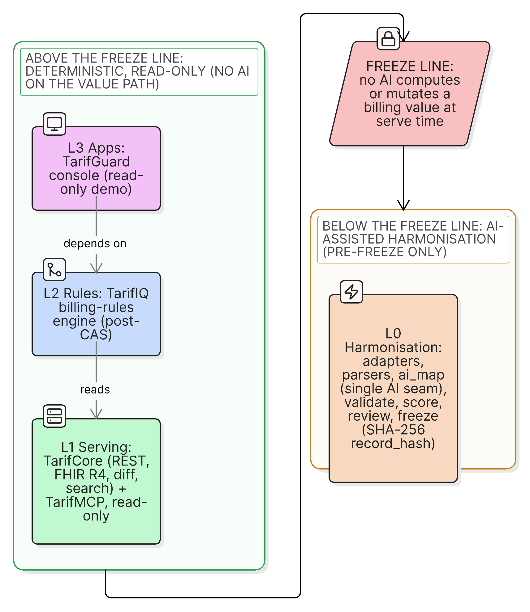
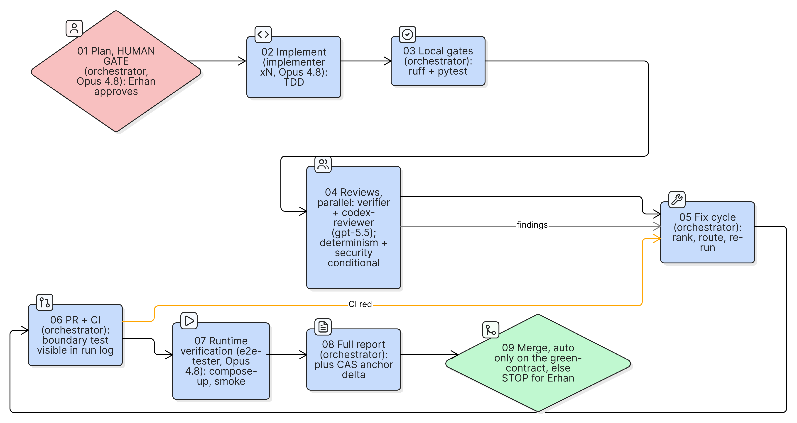
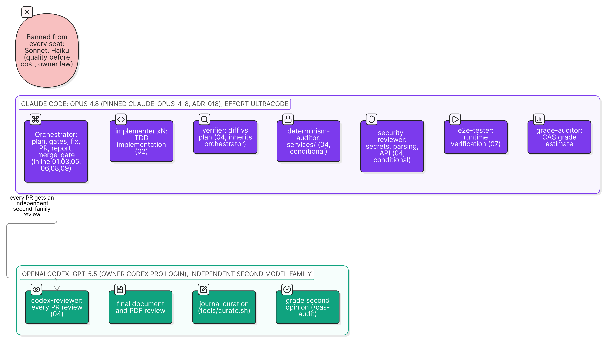
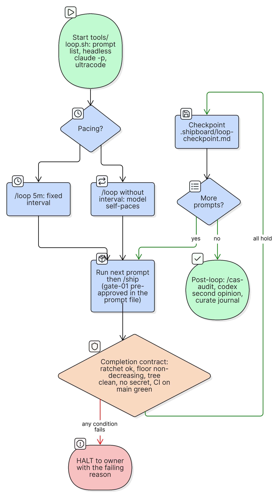
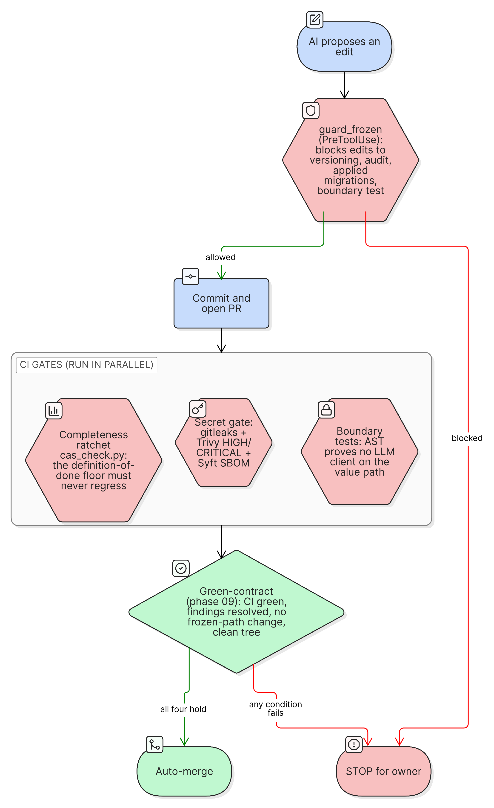
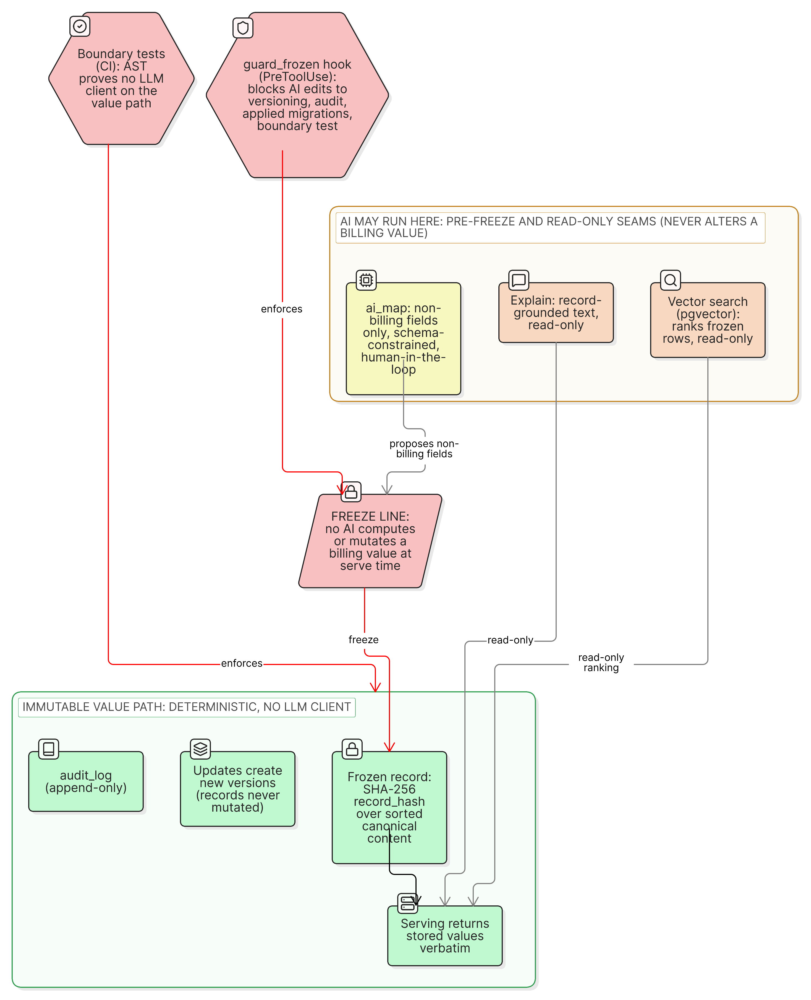
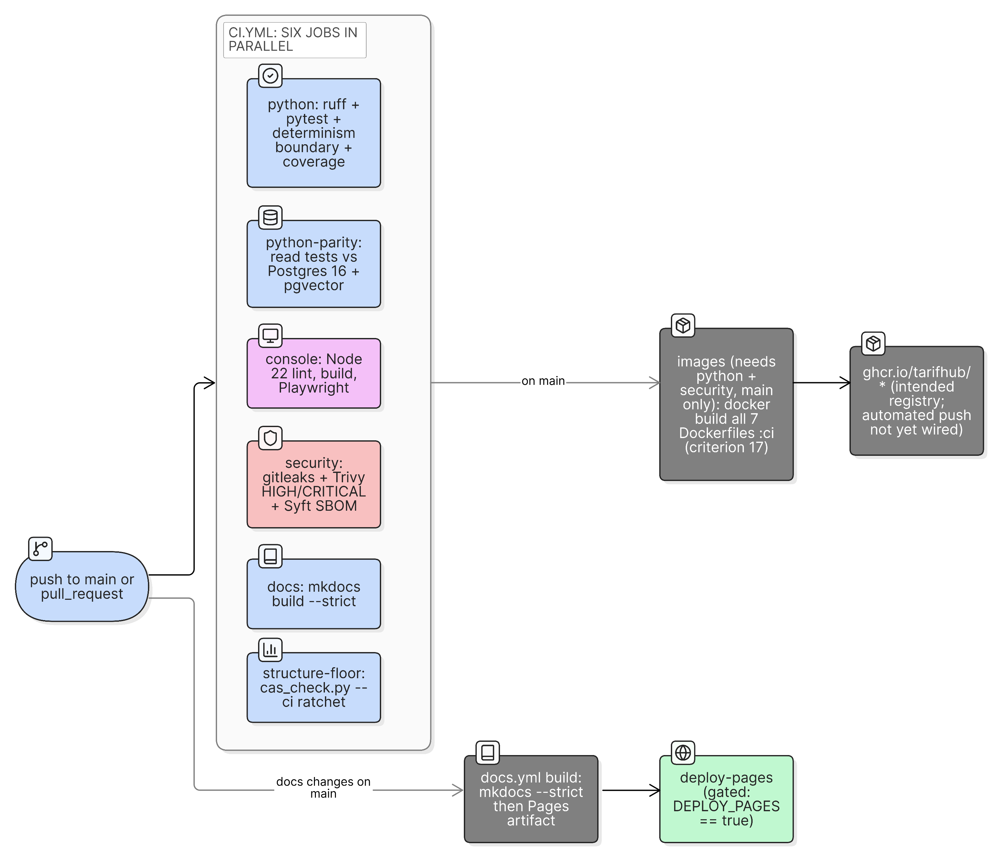

# The AI-SE Framework

This chapter is the system view of how TarifHub was engineered with AI. I did not use AI as an
autocomplete. I built a small software-engineering system around the model: an orchestrator model
plans and reviews, worker models implement and verify, an independent second model family audits,
a dedicated diagram tool generates diagrams as code, deterministic gates define and protect
"done", a closed loop runs the work unattended, and a live dashboard makes every state
inspectable. This chapter describes that framework in the order it is used. Its closing transfer
feeds the [Conclusion](fazit.md) (criterion 18); together with the worked, phase-structured evidence in
the companion [AI Tools and Workflow chapter](ai-tools.md) (Generation, Review, Refactoring,
Research) it forms the criterion-15 account. The two chapters do not overlap: this one is the
apparatus, that one is the worked diffs. Where a mechanism here produced a concrete catch, I name
it and point to the diff in the companion chapter rather than repeating it.

## The complete external tool set

Three external tool families did the work, and naming all three is itself part of the evidence:
the engineering was genuinely multi-tool, not a single chat window.

| Tool family | Role in the framework | Where it lives in the repo |
|---|---|---|
| Claude Code (Opus 4.8; Fable 5 ran the early blocks, with Fable 5 access scheduled to end 22 June 2026) | Orchestrator and worker agents: plan, implement, verify, review, document. | `.claude/` (agents, hooks, skills, settings), `CLAUDE.md` |
| OpenAI Codex CLI (gpt-5.5) | Independent second model family: reviews every pull request, reviews the assembled document, writes a second opinion on each grade estimate, and curates the journal. | `codex-reviewer` agent, `tools/curate.sh` |
| Eraser MCP | Diagram-as-code generation: a described layout becomes Eraser source, rendered and committed as a static file. | `.mcp.json` (`@eraserlabs/eraser-mcp`), `docs/img/diagrams/` |

Two supporting tools complete the picture: Context7 (Model Context Protocol server) fetches current
library and SDK documentation so framework claims trace to live sources rather than a training
cut-off, and GitHub Actions runs the same gates a reviewer would on every push. The point of the
second model family in particular is that a defect invisible to one model's blind spots is often
visible to another's, which the Review evidence in the [companion chapter](ai-tools.md) bears out.

> **Figure: TarifHub's four layers and the freeze line.** L0 harmonisation (AI-assisted, pre-freeze) sits below the line; L1 deterministic serving, L2 rules, and L3 apps sit above it. The single AI seam is confined to L0, and no AI computes or mutates a billing value at serve time.

## 1. Project setup as reproducible context

The repository carries its own operating manual, so any session starts from the same ground
truth. Two control files do the work. `AGENTS.md` holds the project facts: the four-layer
architecture, the stack, the one inviolable rule (no AI computes or mutates a billing value at
serve time), and the conventions. `CLAUDE.md` holds the workflow: how to take tasks, when to plan,
and the effort policy. Because both are checked into the repository, every session starts from the
same constraints and a grader can read exactly the rules the AI was given.

A single model pin in `.claude/settings.json` selects the orchestrator, switched with one command
(`tools/switch_model.sh`) and recorded in [ADR-018](../adr/018-orchestrator-model-lifecycle.md).
Context is therefore versioned and identical across sessions rather than re-explained each time.
Architecture decisions are captured as short ADRs (see
[Architecture Decisions](../arc42/09-architecture-decisions.md) and the
[ADR register](../adr/004-freeze-content-hash-lineage.md)), so the reasoning behind each choice is
part of the repository, not lost in a chat.

## 2. Prompt engineering: outcomes, not scripts

The prompt library (the numbered `prompts/` files, one outcome prompt per block) is written as
outcome prompts: each states the goal, the constraints, and the verification that proves done, and
deliberately omits step-by-step instructions. Modern models perform worse when micromanaged with
scripts written for older models, and better when given a falsifiable definition of success and the
freedom to reach it. Each prompt names its acceptance evidence (tests green, coverage figures,
screenshots captured, a document section present) so the model can self-check before claiming
progress. The mode analysis behind these prompts (vibe versus spec-driven versus agentic) is in the
[decision matrix](decision-matrix.md).

One human gate is built into the prompt itself. A pre-approved plan header lets the session log its
plan and proceed, while still stopping for anything outside the prompt's scope, the protected code,
or a destructive operation. Where a sensitive action does need a human mid-run, the approval bridge
(section 10) routes it for an explicit decision instead of letting it run unseen. This is how a
single pasted prompt becomes an autonomous, bounded unit of work. The companion chapter shows where this discipline caught a real error: an orchestrator brief
that asserted the wrong HTTP status propagated into three files before a fresh-context verifier
checked the actual code path (see [Review evidence](ai-tools.md)).

## 3. The multi-model pipeline (/ship)

The `/ship` pipeline (`.claude/skills/ship/SKILL.md`) runs nine phases: plan approval, TDD
implementation, local structural gates, parallel reviews, a fix cycle, PR and CI, runtime
verification, a consolidated report, and merge. The work is divided by where quality compounds.
The orchestrator does the plan, the orchestration, the merge-gate judgment, and the hard senior
decisions. Worker agents do the volume: an `implementer` writes code test-first, an `e2e-tester`
collects runtime evidence, and a panel of reviewers (a fresh-context `verifier`, a
`determinism-auditor` over the protected paths, a `security-reviewer`) runs in parallel.

Every seat that exercises judgment or writes anything runs the strongest available model at maximum
reasoning effort; weaker models are excluded from those seats by policy (quality before cost).
Models are pinned per seat and never switched mid-task, because model-scoped caches make switching
wasteful. The independent `codex-reviewer` seat runs OpenAI gpt-5.5 via the Codex CLI on the owner's
Codex login and reviews every pull request (section 7).

> **Figure: The nine phases of `/ship`.** From plan approval (gate 01, a human stop) through TDD implementation, local gates, parallel multi-model reviews, the fix cycle, PR and CI, and runtime verification, to the consolidated report and green-contract merge (phase 09, autonomous only when the contract holds). Each phase names its seat and pinned model.

> **Figure: The model and effort map.** Which seat runs which model at which effort: the orchestrator and every worker run on Claude Code (Opus 4.8) at ultracode, and the independent reviewer runs on OpenAI gpt-5.5. Sonnet and Haiku are excluded from every seat by policy.

## 4. Loop engineering

Two loops sit on top of the pipeline. The fixed loop (`tools/loop.sh`) runs a known list of prompts
back to back, headless, checking a completion contract between each step and halting to me with a
reason if anything fails. Its between-step contract is explicit: zero CAS ratchet regressions, a
non-decreasing fitness floor, a clean working tree, and no secret leak. The self-prompting loop
(the auto-loop) closes the planning layer too: each iteration reads the current state, writes the
next task as a prompt itself, runs it through `/ship`, checks the contract, and repeats until a
measurable goal is reached.

The difference matters. A fixed list replays a recording; the self-prompting loop optimises a
moving target, spending each iteration on whatever is most valuable now. It only works because
"done" is machine-checkable (section 5); without that gradient, self-prompting drifts and wastes
effort. The loop runs unattended, curating the engineering journal after each step, writing each
generated prompt to disk so it remains inspectable and vetoable, and checkpointing its state to
`.shipboard/loop-checkpoint.md` so a context refresh never loses progress.

> **Figure: The closed loop.** Read state, choose the pacing (fixed interval or self-paced), run the next prompt through `/ship`, check the between-step completion contract, checkpoint, then repeat or halt to the owner with the failing reason.

## 5. Autonomous quality gates

This is the core idea: an enforced, tested boundary is what makes increasing autonomy safe.

- A deterministic fitness function (`tools/cas_check.py`) expresses the definition of done as
  roughly sixty machine-checkable elements, each with an evidence path, producing a pass or miss
  and a JSON summary. A committed baseline (`tools/cas_baseline.json`) acts as a ratchet: once an
  element passes it must keep passing, and a regression fails CI. This turns "are we done" from
  opinion into measurement and gives the loop a gradient to climb.
- The protected boundary (internally the freeze line) is guarded two ways: a pre-tool hook
  (`.claude/hooks/guard_frozen.sh`) blocks any agent edit to the billing-integrity code and halts
  the agent rather than letting it work around the rule, and a test asserts no model client is
  importable on the value path (`services/ingestion/tests/test_determinism_boundary.py` and
  `services/serving/tests/test_serving_boundary.py`), failing CI otherwise. The agent can run hard
  everywhere else precisely because this line cannot be crossed silently. The boundary's design is
  documented in [Crosscutting Concepts](../arc42/08-crosscutting-concepts.md),
  [ADR-002](../adr/002-freeze-line-decomposition.md) and
  [ADR-004](../adr/004-freeze-content-hash-lineage.md).
- The green-contract governs autonomous merge. Phase 09 merges only when all four conditions hold:
  CI is fully green including the security and boundary tests, every review finding is resolved or
  explicitly dispositioned with no open P1 or P2, the diff touches no frozen path beyond what I
  authorized this session, and the working tree is clean with the branch current. The CAS fitness
  ratchet showing no regression is folded into the same contract: a regression is a failing check
  that blocks the merge. Anything less stops for me.
- A secret gate runs on every loop iteration (gitleaks, with a key-shaped grep fallback) so no
  credential can ride the loop into a public repository, independent of CI timing.

The freeze-line guard is not theory: in the first real Postgres run it blocked an edit to
`audit/audit_logger.py` below the line, the work halted, and I authorized exactly one line in an
isolated commit with the diff shown first. The worked record is in the
[companion chapter](ai-tools.md).

> **Figure: The autonomous quality gates.** The freeze-line guard hook, the fitness ratchet, the secret gate, and the boundary tests, then the four-condition green-contract that governs autonomous merge, and what each one blocks.

> **Figure: The freeze line.** Above it, the AI seam (ai_map) and the read-only search and explain seams that never alter a value; below it, the immutable hashed records and the deterministic serving path. Two enforcement points, the pre-tool guard hook and the boundary test, hold the line.

## 6. The CI/CD pipeline

GitHub Actions enforces the same standards a reviewer would, on every push and pull request
(`.github/workflows/ci.yml`): lint and format (ruff), the full offline test suite, the determinism
boundary tests printed visibly in the log, a secrets scan (gitleaks), a vulnerability and SBOM scan
(Trivy and Syft), and a dedicated ratchet job (`cas-anchors`) that runs the fitness function in
read-only mode (`python3 tools/cas_check.py --ci`) and fails only on a regression. Container images
are built on the main branch as the distribution evidence for criterion 17. The
documentation site builds under strict mode and deploys to GitHub Pages
(`.github/workflows/docs.yml`), gated behind an explicit permission so publication is a deliberate
act. CI is also the loop's backstop: the between-step contract requires the latest run to be green
before it proceeds, so a red pipeline halts the automation. The pipeline rationale is recorded in
[ADR-010](../adr/010-github-actions-devsecops.md).

> **Figure: The CI/CD pipeline.** Six jobs run in parallel on every push and pull request (lint and tests with the boundary tests, read-parity against Postgres, the console build, security with secrets, vulnerabilities and SBOM, the docs strict build, and the anchor ratchet); on main, an images job builds every container as criterion-17 evidence, and a separate workflow builds the docs and deploys to Pages behind an explicit gate.

## 7. Independent second-model review

A Claude-reviewed Claude diff can share blind spots. To break that, an independent model family
(OpenAI gpt-5.5 via the Codex CLI, the `codex-reviewer` seat) reviews every pull request for
correctness, edge cases, security, and missing tests; reviews the assembled final document; and
writes a second opinion on each grade self-estimate, flagging disagreements and missed gaps. In
practice this caught defects the same-family review missed, including a billing-field guard
implemented client-side only and a review path that masked an upstream failure as success; both
were fixed before merge. The full worked catches, with prompts, diffs and commits, are in the
[Review section of the companion chapter](ai-tools.md). Using a second family is both an
engineering safeguard and, for this course, evidence of genuine multi-tool AI-assisted engineering.

## 8. Observability

A single-file, dependency-free dashboard (`tools/shipboard/shipboard.py`) makes the whole system
legible. It reads explicit pipeline events, the session transcript, the git and GitHub state, the
vault, and the fitness function, and presents them as tabs: the pipeline rail, per-agent activity
and cost, the project and CI state, the grading floor, and a Loop tab showing run milestones plus
live agent activity. The Loop tab also carries the approval bridge: an Approvals panel, with a
count badge in the header, that lists any side-effectful action waiting on a human and resolves it
with an Approve or Deny button. It is one queue with two surfaces, the panel and a Telegram bot
(`tools/approval_telegram.py`), sharing a single decision file that the dashboard publishes
atomically, so a later tap on either surface returns the standing decision and the other reflects it
within one refresh tick; the gate appends each request and the decision it enforces to
`.shipboard/approvals/log.jsonl`. The guiding rule is that the board never asserts a state it cannot
show evidence for; it says "unknown" rather than inventing progress, which is what lets me trust it
while the loop runs unattended. The product's own runtime observability is a separate concern,
recorded in [ADR-011](../adr/011-opentelemetry-observability.md).

## 9. Documentation and diagrams as code

The documentation is produced by the same pipeline that produces the software, not written by hand
at the end. The architecture chapters, this method chapter, the journal, and the Conclusion are drafted
by the models from the contemporaneous record, then reviewed by me.

Diagrams are generated the same way. A dedicated diagram tool (the Eraser MCP, configured in
`.mcp.json`) turns a described layout into Eraser diagram-as-code, renders it, and the pipeline
commits the result as a static PNG under `docs/img/diagrams/` with its diagram-as-code source
beside it, embedded with a caption (every figure in this chapter was produced by exactly this
step). Nothing in the repository or the submission PDF depends on a live diagram service at read
time; the rendered files are checked in, so the documentation is self-contained and reproducible.
This makes diagramming a first-class, autonomous step in the loop rather than a manual afterthought,
and it is the third external tool family in the workflow, alongside Claude Code and the independent
OpenAI reviewer.

The journal is produced the same way: a session-end hook drafts the day's `vault/daily/` entry and
`tools/curate.sh` rewrites it through Codex gpt-5.5, sandboxed and read-only, into curated prose
that I edit at my discretion before it counts as evidence. The worked disclosure of that pipeline,
with the entries it produced, is in the [companion chapter](ai-tools.md).

## 10. The human floor

Some decisions are never delegated, by design, not by limitation. No AI touches the billing
boundary without my explicit line-by-line approval. Plan approval (gate 01) and the merge
green-contract (phase 09) sit under human judgment. Final acceptance, the go-live decision, the
Moodle submission, and the declaration of independent work stay with me. The framework is built so
that autonomy increases up to these lines and stops cleanly at them.

The approval bridge upgrades how these lines are held at runtime. Before it, an unattended run could
only stop hard and wait to be rerun; with it, a sensitive action (a push to `main`, a merge, a
destructive git command, a publish) is paused, routed to me on the dashboard or by Telegram, and
resumed on a tap, so the human floor becomes a routed and logged control rather than an asserted one.
A `PreToolUse` hook (`.claude/hooks/approval_gate.sh`) classifies the action and blocks until a
decision arrives. It is fail-safe and opt-in: a hard no-op unless `APPROVALS_ON=1`, and if no
decision arrives within the timeout it denies, so the worst case is exactly the safe halt that
already existed. Enabling live approvals is itself a deliberate owner step (the default permission
mode, `APPROVALS_ON=1`, and the Telegram daemon running), recorded in `NEXT_STEPS.md`; the
unattended loop ships with the gate off, so its behaviour is unchanged. These vetoes are stated and
justified in the [Conclusion](fazit.md) (criterion 18).

## Transfer to future practice

The most useful outcome is not this project but the method, which I have packaged as a reusable
framework: a build brief plus a bootstrap prompt that scaffolds a new project, its repository, its
quality gates, its dashboard, and its auto-loop on its own. The lesson generalises beyond any one
codebase: an enforced, tested definition of done is the precondition for trustworthy AI autonomy.
Give the system a gradient it can measure and boundaries it cannot cross, and it can carry the
work; withhold those, and more autonomy only produces faster drift. That is the principle I will
carry into future engineering, and it is the throughline I return to in the [Conclusion](fazit.md).
